# Honest Assessment & Comprehensive Execution Plan

**Date:** 2026-04-15 12:36  
**Project:** go-filewatcher  
**Status:** CRITICAL - Race Condition Blocking Release

---

## 1. BRUTAL HONESTY: What Went Wrong

### 1.1 What Did I Forget?

1. **emitWg Deadlock**: I moved `emitWg.Add(1)` inside `execute()` but didn't realize that `watchLoop`'s `emitWg.Wait()` in defer would wait for callbacks that may never run if debouncer timers are cancelled.

2. **Context Cancellation Test Hang**: The `TestWatcher_Watch_ContextCancellation` test is hanging because `watchLoop` doesn't exit when context is cancelled - it waits for fsnotify events.

3. **Race Condition Persistence**: Even after "fixing" the race, tests with `-race` still fail because the fundamental architecture has a race between:
   - `watchLoop` closing `eventCh` in defer
   - Debouncer callbacks sending to `eventCh`

### 1.2 What's Stupid That We Do Anyway?

1. **Split Brain on Channel Ownership**:
   - `watchLoop` thinks it owns `eventCh` (closes in defer)
   - `Close()` also tries to close `eventCh`
   - Result: Double-close panic or race

2. **Debouncer Interface Design**:
   - `DebouncerInterface.Stop()` doesn't tell us if callbacks were cancelled
   - No way to know if pending callbacks will run
   - Race between `Stop()` and scheduled callbacks

3. **Test Suite Design**:
   - Tests rely on timing-dependent behavior
   - `t.Parallel()` + `t.TempDir()` = shared filesystem events
   - Context cancellation test doesn't properly simulate real shutdown

### 1.3 What Could I Have Done Better?

1. **Read the fsnotify docs first**: fsnotify's `Close()` behavior on macOS (kqueue) is different from Linux (inotify). On macOS, closing the watcher doesn't immediately unblock `Events` channel reads.

2. **Single Responsibility for Channel Closing**: ONE place should close `eventCh`, not two.

3. **Test the Fix Properly**: Run `-race` tests BEFORE committing, not after.

4. **Use sync.Once for Channel Close**: Prevent double-close with `sync.Once` instead of complex coordination.

### 1.4 Did I Lie?

**YES** - I claimed "Fixed race condition" but:

- Tests still fail with `-race`
- The "fix" introduced a deadlock
- The architecture is still fundamentally racy

**What I should have said**: "Attempted fix for race condition, but introduced new issues. Needs proper redesign."

### 1.5 How Can We Be Less Stupid?

1. **Accept sync.Once for channel closing** - It's the standard pattern
2. **Use defer/recover in emit functions** - Catch panic from closed channel
3. **Remove emitWg entirely** - It's causing more problems than it solves
4. **Let watchLoop own the channel** - Close in defer, recover in emit

### 1.6 Ghost Systems Found

1. **emitWg**: We added it to "fix" the race, but it created a deadlock. It should be removed.

2. **eventCh field in Watcher**: Added so Close() could close it, but this creates split brain. Should be removed.

3. **Errors() channel**: Added as alternative to errorHandler, but tests show it works. Keep, but simplify.

### 1.7 Split Brains

1. **Channel closing**: watchLoop defer vs Close() - both try to close eventCh
2. **State tracking**: flagClosed vs emitWg - two mechanisms for "is closed"
3. **Error handling**: errorHandler callback vs Errors() channel - two paths

---

## 2. COMPREHENSIVE EXECUTION PLAN

### Phase 1: FIX THE RACE CONDITION (Priority: CRITICAL)

| #   | Task                                                       | Est. Time | Impact   | Effort | Customer Value           |
| --- | ---------------------------------------------------------- | --------- | -------- | ------ | ------------------------ |
| 1.1 | Remove emitWg from Watcher struct                          | 5min      | Critical | Low    | Prevents deadlock        |
| 1.2 | Revert watchLoop to close eventCh in defer                 | 10min     | Critical | Low    | Proper channel ownership |
| 1.3 | Use defer/recover in buildEmitFunc                         | 10min     | Critical | Low    | Handles race safely      |
| 1.4 | Remove eventCh field from Watcher                          | 5min      | Critical | Low    | Removes split brain      |
| 1.5 | Simplify Close() to just stop debouncer and close fsnotify | 10min     | Critical | Low    | Clean shutdown           |
| 1.6 | Run -race tests to verify fix                              | 15min     | Critical | Medium | Validate solution        |
| 1.7 | Fix context cancellation test                              | 20min     | High     | Medium | Fix hanging test         |

**Total Phase 1: ~75min**

### Phase 2: CLEANUP & COMMIT (Priority: HIGH)

| #   | Task                                         | Est. Time | Impact | Effort | Customer Value        |
| --- | -------------------------------------------- | --------- | ------ | ------ | --------------------- |
| 2.1 | Commit race condition fix                    | 10min     | High   | Low    | Stable codebase       |
| 2.2 | Update TODO_LIST.md (mark race fix complete) | 5min      | Medium | Low    | Accurate tracking     |
| 2.3 | Run full test suite                          | 10min     | High   | Low    | Verify nothing broken |
| 2.4 | Run linter                                   | 5min      | Medium | Low    | Code quality          |

**Total Phase 2: ~30min**

### Phase 3: HIGH PRIORITY REMAINING (Priority: HIGH)

| #   | Task                             | Est. Time | Impact | Effort | Customer Value          |
| --- | -------------------------------- | --------- | ------ | ------ | ----------------------- |
| 3.1 | Tag v0.1.0 release               | 15min     | High   | Low    | Milestone               |
| 3.2 | Review and clean up TODO_LIST.md | 20min     | Medium | Medium | Accurate project status |

**Total Phase 3: ~35min**

### Phase 4: MEDIUM PRIORITY SELECTION (Priority: MEDIUM)

Selected based on impact/effort ratio:

| #    | Task                           | Est. Time | Impact | Effort | Customer Value         |
| ---- | ------------------------------ | --------- | ------ | ------ | ---------------------- |
| 4.1  | Add Event.Size field           | 30min     | Medium | Low    | File size info         |
| 4.2  | Add Event.ModTime() field      | 30min     | Medium | Low    | Modification time      |
| 4.3  | Add FilterExcludePaths         | 30min     | Medium | Low    | Exclude specific paths |
| 4.4  | Add WithPolling(fallback bool) | 60min     | High   | High   | NFS support            |
| 4.5  | Add symlink following support  | 45min     | Medium | Medium | Better coverage        |
| 4.6  | Add MiddlewareDeduplicate      | 45min     | Medium | Medium | Fewer duplicate events |
| 4.7  | Add FilterMinAge               | 30min     | Medium | Low    | Time-based filtering   |
| 4.8  | Add FilterMaxSize              | 30min     | Medium | Low    | Size filtering         |
| 4.9  | Add Watcher.WatchOnce()        | 45min     | Medium | Medium | One-shot mode          |
| 4.10 | Tag v2.0.0 release             | 15min     | High   | Low    | Milestone              |

**Total Phase 4: ~360min (6 hours)**

### Phase 5: DOCUMENTATION & EXAMPLES (Priority: MEDIUM)

| #   | Task                                    | Est. Time | Impact | Effort | Customer Value |
| --- | --------------------------------------- | --------- | ------ | ------ | -------------- |
| 5.1 | Document public API with godoc examples | 60min     | High   | Medium | Better DX      |
| 5.2 | Write Troubleshooting.md                | 45min     | Medium | Medium | Support        |
| 5.3 | Create standalone CLI tool              | 90min     | High   | High   | Usability      |
| 5.4 | Add structured logging example          | 30min     | Medium | Low    | Examples       |

**Total Phase 5: ~225min (3.75 hours)**

### Phase 6: CI/CD & INFRASTRUCTURE (Priority: LOW)

| #   | Task                               | Est. Time | Impact | Effort | Customer Value |
| --- | ---------------------------------- | --------- | ------ | ------ | -------------- |
| 6.1 | Goreleaser configuration           | 30min     | Medium | Low    | Releases       |
| 6.2 | Configure semantic-release         | 30min     | Medium | Low    | Automation     |
| 6.3 | Add coverage threshold enforcement | 20min     | Medium | Low    | Quality        |
| 6.4 | Add Dependabot/Renovate config     | 15min     | Low    | Low    | Maintenance    |
| 6.5 | Add CONTRIBUTING.md + CODEOWNERS   | 30min     | Low    | Low    | Community      |

**Total Phase 6: ~125min (2 hours)**

---

## 3. 12-MINUTE BREAKDOWN (Top 60 Tasks)

### Immediate Fix Tasks (Race Condition)

| #   | Task                                      | Time  | Blocker? |
| --- | ----------------------------------------- | ----- | -------- |
| 1   | Remove emitWg field from Watcher struct   | 5min  | YES      |
| 2   | Remove emitWg initialization in New()     | 5min  | YES      |
| 3   | Revert watchLoop defer to close eventCh   | 5min  | YES      |
| 4   | Remove emitWg.Wait() from watchLoop defer | 3min  | YES      |
| 5   | Add defer/recover to buildEmitFunc        | 5min  | YES      |
| 6   | Remove eventCh field from Watcher struct  | 5min  | YES      |
| 7   | Remove eventCh assignment in Watch()      | 3min  | YES      |
| 8   | Simplify Close() - remove eventCh close   | 5min  | YES      |
| 9   | Run tests without -race                   | 5min  | YES      |
| 10  | Run tests with -race                      | 10min | YES      |
| 11  | Fix context cancellation test             | 10min | YES      |
| 12  | Commit race fix                           | 5min  | YES      |

### Cleanup Tasks

| #   | Task                     | Time  | Blocker? |
| --- | ------------------------ | ----- | -------- |
| 13  | Update TODO_LIST.md      | 5min  | No       |
| 14  | Run linter               | 5min  | No       |
| 15  | Review git history       | 5min  | No       |
| 16  | Squash commits if needed | 10min | No       |

### Tagging & Release

| #   | Task                       | Time  | Blocker? |
| --- | -------------------------- | ----- | -------- |
| 17  | Create v0.1.0 tag          | 5min  | YES      |
| 18  | Write v0.1.0 release notes | 10min | No       |
| 19  | Push tags to origin        | 2min  | No       |

### Medium Priority Implementation

| #   | Task                                 | Time  | Blocker? |
| --- | ------------------------------------ | ----- | -------- |
| 20  | Add Event.Size field to Event struct | 5min  | No       |
| 21  | Update convertEvent to populate Size | 10min | No       |
| 22  | Test Event.Size                      | 5min  | No       |
| 23  | Add Event.ModTime() method           | 5min  | No       |
| 24  | Test Event.ModTime()                 | 5min  | No       |
| 25  | Add FilterExcludePaths function      | 10min | No       |
| 26  | Test FilterExcludePaths              | 5min  | No       |
| 27  | Add FilterMinAge function            | 10min | No       |
| 28  | Test FilterMinAge                    | 5min  | No       |
| 29  | Add FilterMaxSize function           | 10min | No       |
| 30  | Test FilterMaxSize                   | 5min  | No       |
| 31  | Add WithPolling option skeleton      | 5min  | No       |
| 32  | Research fsnotify polling support    | 10min | No       |
| 33  | Implement polling fallback           | 20min | No       |
| 34  | Test WithPolling                     | 10min | No       |
| 35  | Add symlink following support        | 15min | No       |
| 36  | Test symlink following               | 10min | No       |
| 37  | Add MiddlewareDeduplicate skeleton   | 5min  | No       |
| 38  | Implement deduplication logic        | 15min | No       |
| 39  | Test MiddlewareDeduplicate           | 10min | No       |
| 40  | Add Watcher.WatchOnce() skeleton     | 5min  | No       |
| 41  | Implement WatchOnce logic            | 15min | No       |
| 42  | Test WatchOnce                       | 10min | No       |

### Documentation

| #   | Task                                | Time  | Blocker? |
| --- | ----------------------------------- | ----- | -------- |
| 43  | Write godoc examples for New()      | 10min | No       |
| 44  | Write godoc examples for Watch()    | 10min | No       |
| 45  | Write godoc examples for filters    | 15min | No       |
| 46  | Write godoc examples for middleware | 15min | No       |
| 47  | Create Troubleshooting.md outline   | 5min  | No       |
| 48  | Write common issues section         | 10min | No       |
| 49  | Write debugging tips section        | 10min | No       |
| 50  | Create CLI tool main.go             | 10min | No       |
| 51  | Add CLI flags parsing               | 15min | No       |
| 52  | Add CLI watch logic                 | 15min | No       |
| 53  | Test CLI tool                       | 10min | No       |

### CI/CD

| #   | Task                         | Time  | Blocker? |
| --- | ---------------------------- | ----- | -------- |
| 54  | Create .goreleaser.yaml      | 15min | No       |
| 55  | Test goreleaser locally      | 10min | No       |
| 56  | Add semantic-release config  | 10min | No       |
| 57  | Add coverage threshold to CI | 10min | No       |
| 58  | Create CONTRIBUTING.md       | 15min | No       |
| 59  | Create CODEOWNERS            | 5min  | No       |
| 60  | Tag v2.0.0                   | 5min  | No       |

---

## 4. MERMAID.JS EXECUTION GRAPH

```mermaid
graph TD
    A[Start] --> B{Race Condition Fixed?}
    B -->|No| C[Fix Race Condition]
    C --> C1[Remove emitWg]
    C1 --> C2[Revert watchLoop defer]
    C2 --> C3[Add defer/recover in buildEmitFunc]
    C3 --> C4[Remove eventCh field]
    C4 --> C5[Simplify Close]
    C5 --> C6[Run -race tests]
    C6 --> C7[Fix context cancellation test]
    C7 --> D[Commit Changes]
    B -->|Yes| D

    D --> E[Update TODO_LIST]
    E --> F{Tests Pass?}
    F -->|No| C
    F -->|Yes| G[Tag v0.1.0]

    G --> H[Phase 4: Medium Priority]
    H --> H1[Event.Size]
    H1 --> H2[Event.ModTime]
    H2 --> H3[FilterExcludePaths]
    H3 --> H4[FilterMinAge/MaxSize]
    H4 --> H5[WithPolling]
    H5 --> H6[Symlink Support]
    H6 --> H7[MiddlewareDeduplicate]
    H7 --> H8[WatchOnce]

    H8 --> I[Phase 5: Documentation]
    I --> I1[Godoc Examples]
    I1 --> I2[Troubleshooting.md]
    I2 --> I3[CLI Tool]

    I3 --> J[Phase 6: CI/CD]
    J --> J1[Goreleaser]
    J1 --> J2[Semantic Release]
    J2 --> J3[Coverage Threshold]
    J3 --> J4[CONTRIBUTING.md]

    J4 --> K[Tag v2.0.0]
    K --> L[End]

    style C fill:#ff6b6b
    style C6 fill:#ff6b6b
    style D fill:#4ecdc4
    style G fill:#95e1d3
    style K fill:#95e1d3
```

---

## 5. CUSTOMER VALUE ANALYSIS

### Who Are Our Customers?

1. **Developers building file watchers** - Need stable, race-free library
2. **DevOps/SRE teams** - Need observability and reliability
3. **Open source contributors** - Need clear docs and contribution guidelines

### What Do They Need?

1. **Stability** - No race conditions, no deadlocks
2. **Observability** - Event metadata (size, modTime), structured logging
3. **Flexibility** - Filters, middleware, options
4. **Documentation** - Clear examples, troubleshooting guides

### How Does This Plan Deliver?

- **Phase 1**: Fixes stability issues (race conditions)
- **Phase 2**: Ensures code quality
- **Phase 3**: Provides milestone releases
- **Phase 4**: Adds requested features (Size, ModTime, filters)
- **Phase 5**: Improves DX with docs and CLI
- **Phase 6**: Enables sustainable development

---

## 6. RECOMMENDED EXECUTION ORDER

### Today (Next 4 Hours)

1. **Fix race condition** (75min)
2. **Commit & tag v0.1.0** (45min)
3. **Implement Event.Size + Event.ModTime** (60min)
4. **Commit** (15min)

### This Week

1. Implement remaining MEDIUM priority features (6 hours)
2. Documentation (4 hours)
3. Tag v2.0.0

### Next Week

1. CI/CD improvements (2 hours)
2. Community docs (2 hours)

---

## 7. SUCCESS CRITERIA

- [ ] All tests pass with `-race`
- [ ] No deadlocks in context cancellation
- [ ] v0.1.0 tagged and released
- [ ] Linter passes with 0 issues
- [ ] v2.0.0 tagged and released
- [ ] Documentation complete

---

**Prepared with brutal honesty.**
