# Comprehensive Execution Plan — go-filewatcher

**Date:** 2026-05-03 01:49 CEST
**Branch:** `master` (ahead of origin by 2 commits)
**Scope:** ALL open TODOs from TODO_LIST.md + status report bugs + discovered improvements
**Constraint:** Each task ≤ 12 minutes
**Total Tasks:** 88
**Estimated Total:** ~13.5 hours

---

## Pareto Breakdown

| Tier | Tasks | % of Total | Impact | Description |
|---|---|---|---|---|
| **T1 — The 1%** → 51% | #1–#5 | 6% | 🔴 CRITICAL | Bugs & toolchain breaks. MUST DO NOW. |
| **T2 — The 4%** → 64% | #6–#17 | 14% | 🟠 HIGH | Code quality, safety, obvious fixes |
| **T3 — The 20%** → 80% | #18–#38 | 24% | 🟡 MEDIUM | Test gaps, docs, DX infrastructure |
| **T4 — The 80%** → 100% | #39–#88 | 57% | 🟢 LOW | Features, integrations, nice-to-haves |

---

## T1 — BUG FIXES & CRITICAL (1% → 51% Impact)

*Must-do. These are bugs, broken tooling, or things shipping to consumers that shouldn't.*

| # | Task | Files | Est. | Impact | Why |
|---|---|---|---|---|---|
| 1 | Fix `Add()` double-append to `watchList` bug | `watcher.go`, `watcher_walk.go` | 12m | 🔴 | `WatchList()` returns duplicates in recursive mode. User-facing bug. |
| 2 | Fix `MiddlewareBatch` timer error swallowing | `middleware.go:342` | 10m | 🔴 | `_ = flush(events)` silently drops errors on timer-triggered flush. Log or propagate. |
| 3 | Fix `handleNewDirectory` error swallowing | `watcher_internal.go:193` | 10m | 🔴 | `_ = w.addPath(...)` silently fails to add new subdirectories. Log the error at minimum. |
| 4 | Align flake.nix Go 1.24 → 1.26 | `flake.nix` | 5m | 🔴 | CI uses 1.26, linter targets 1.26.1, but `nix develop` gives Go 1.24. Broken toolchain. |
| 5 | Move `testing_helpers.go` out of production binary | `testing_helpers.go` | 12m | 🔴 | 306 lines of test-only code compiled into consumer binaries. Add `//go:build tools` tag or rename. |

---

## T2 — CODE QUALITY & SAFETY (4% → 64% Impact)

*Should-do immediately. Low effort, high reliability/safety improvement.*

| # | Task | Files | Est. | Impact | Why |
|---|---|---|---|---|---|
| 6 | Replace hand-rolled `Op.MarshalJSON` with `json.Marshal` | `event.go:55` | 5m | 🟠 | String concat `"\"" + op.String() + "\""` is fragile, no escaping. Use `json.Marshal(op.String())`. |
| 7 | Protect `DefaultIgnoreDirs` from mutation | `watcher.go` | 5m | 🟠 | Exported `var []string` — users can accidentally mutate shared slice. Return copy or use accessor. |
| 8 | Simplify `errors.As` to `AsType[*WatcherError]` | `errors.go:94` | 5m | 🟠 | gopls hint: modernize to Go 1.26 `AsType` pattern. |
| 9 | Ring buffer for `MiddlewareSlidingWindowRateLimit` | `middleware.go:168-176` | 12m | 🟠 | Allocates new slice on every event. Replace with in-place ring buffer. |
| 10 | Document `GlobalDebouncer` callback replacement caveat | `debouncer.go` | 5m | 🟠 | Only last callback survives coalescing — undocumented. Add doc comment. |
| 11 | `FilterExcludePaths`: skip redundant `filepath.Abs` per event | `filter.go:102` | 8m | 🟠 | Path already absolute from fsnotify. Cache or skip re-normalization. |
| 12 | Validate `WithBuffer(0)` behavior — error or document | `options.go` | 5m | 🟠 | Unbuffered channel (0) may deadlock. Either reject or document clearly. |
| 13 | Validate debounce durations — cap at reasonable max | `options.go`, `debouncer.go` | 8m | 🟠 | No validation on duration. Negative or absurdly large values cause issues. |
| 14 | Remove `nolint:unparam` from `getDebounceKey` | `watcher_internal.go` | 5m | 🟠 | Investigate if the parameter is actually used now. Clean up the suppression. |
| 15 | Validate `FilterRegex` compiles in constructor | `filter.go` | 5m | 🟠 | Invalid regex panics at event time. Validate at construction. |
| 16 | `handleNewDirectory`: propagate addPath errors to error handler | `watcher_internal.go` | 10m | 🟠 | Instead of `_ = w.addPath(...)`, call `handleError` on failure. |
| 17 | `MiddlewareBatch`: propagate timer flush errors | `middleware.go` | 10m | 🟠 | Instead of `_ = flush(events)`, log via slog or call onError handler. |

---

## T3 — TEST COVERAGE GAPS (20% → 80% Impact)

*Close the holes. Low-to-medium effort, high confidence improvement.*

| # | Task | Files | Est. | Impact | Why |
|---|---|---|---|---|---|
| 18 | Add rename event integration test | `watcher_test.go` | 10m | 🟡 | Only Create/Write/Remove tested end-to-end. Rename is a first-class Op. |
| 19 | Add multi-directory initialization test (`New([]string{d1,d2})`) | `watcher_test.go` | 10m | 🟡 | Core use case with zero test coverage. |
| 20 | Add buffer overflow / backpressure test | `watcher_test.go` | 10m | 🟡 | `WithBuffer(n)` never tested for full-channel behavior. |
| 21 | Add concurrent Add/Remove during active watching test | `watcher_test.go` | 12m | 🟡 | Race conditions possible, zero test coverage. |
| 22 | Add non-recursive watching integration test | `watcher_test.go` | 10m | 🟡 | `WithRecursive(false)` never tested for ignoring subdirs. |
| 23 | Close coverage gaps: `addPath` (83.3%), `walkDirFunc` (84.6%) | `watcher_walk_test.go` | 12m | 🟡 | Below 90% threshold. Add error path tests. |
| 24 | Close coverage gap: `Add` (84.6%) — test error paths | `watcher_test.go` | 10m | 🟡 | Double-add, add-after-close, add-during-watch. |
| 25 | Add test for `handleError()` stderr path | `watcher_test.go` | 10m | 🟡 | When no error handler/channel configured, errors go to stderr. Untested. |
| 26 | Add test for `GlobalDebouncer.Flush()` | `debouncer_test.go` | 8m | 🟡 | Flush is tested for per-key Debouncer but not GlobalDebouncer. |
| 27 | Add test for `handleError` with `ErrorContext` | `watcher_test.go` | 10m | 🟡 | ErrorContext propagation through error handler is untested. |
| 28 | Add `FilterGeneratedCodeFull` content-check tests for Templ/Protobuf | `filter_gogen_test.go` | 10m | 🟡 | Only SQLC content check tested. Other modes untested. |
| 29 | Add `Example_FilterRegex` godoc example | `example_test.go` | 8m | 🟡 | Missing example for a commonly-used filter. |
| 30 | Fix `TestErrorHandler_Async` — assert `callCount == 10` | `errors_test.go` | 8m | 🟡 | Test spawns 10 goroutines but never verifies all complete. Effectively a no-op test. |
| 31 | Review parallel tests for race safety | all `*_test.go` | 12m | 🟡 | 12 tests not using `t.Parallel()`. Some may be unnecessarily serialized. |
| 32 | Fix flaky `TestWatcher_Stats_Metrics` timing sensitivity | `watcher_test.go` | 10m | 🟡 | Known flaky — filesystem write coalescing may produce 2 events instead of 1. |
| 33 | Fix flaky `TestWatcher_Watch_WithMiddleware` timing sensitivity | `watcher_test.go` | 10m | 🟡 | Known flaky — same root cause as above. |
| 34 | Add `Watcher.Errors()` channel closure after `Close()` test | `watcher_test.go` | 8m | 🟡 | Only verifies channel exists, not that it closes properly. |
| 35 | Add error channel test for naturally-occurring fs errors | `watcher_test.go` | 12m | 🟡 | e.g., permission denied, deleted watched root directory. |
| 36 | Add test for `IsWatching()`/`IsClosed()` state transitions during failed `Watch()` | `watcher_test.go` | 10m | 🟡 | State during/after failed Watch() is untested. |
| 37 | Add test for `WithIgnorePatterns()` using glob patterns | `filter_test.go`, `filter.go` | 12m | 🟡 | Feature request — glob-based ignore patterns (different from FilterGlob). |
| 38 | Add coverage for phantom type methods: `IsZero`, `Equal`, `Compare` | `phantom_types_test.go` | 10m | 🟡 | Several `IsZero`/`Equal`/`Compare` methods at 0% coverage. |

---

## T4a — DOCUMENTATION & RELEASE (80% → 100% Impact)

*Enable adoption. Now that we're MIT-licensed, this matters.*

| # | Task | Files | Est. | Impact | Why |
|---|---|---|---|---|---|
| 39 | Populate CHANGELOG.md for v0.1.0 release | `CHANGELOG.md` | 5m | 🟢 | No versioned entries exist. |
| 40 | Populate CHANGELOG.md for v0.2.0 release | `CHANGELOG.md` | 5m | 🟢 | No versioned entries exist. |
| 41 | Write `CONTRIBUTING.md` | new file | 12m | 🟢 | Now MIT-licensed — external contributions possible. No guide exists. |
| 42 | Write `CODE_OF_CONDUCT.md` | new file | 8m | 🟢 | Standard for open-source projects. |
| 43 | Add GitHub issue templates | `.github/ISSUE_TEMPLATE/` | 10m | 🟢 | Bug report + feature request templates. |
| 44 | Add GitHub PR template | `.github/PULL_REQUEST_TEMPLATE.md` | 8m | 🟢 | Consistent review process. |
| 45 | Write Troubleshooting.md | new file | 12m | 🟢 | Common issues: NFS, permissions, recursive watching gotchas. |
| 46 | Write migration guide for ErrorHandler signature change | `MIGRATION.md` | 10m | 🟢 | Update existing MIGRATION.md with ErrorHandler changes. |
| 47 | Add structured logging example | `examples/` | 10m | 🟢 | Show slog integration with MiddlewareLogging. |
| 48 | Document DI integration patterns in README | `README.md` | 10m | 🟢 | How to inject Watcher in DI frameworks. |
| 49 | Consolidate `doc.go` — sync with README examples | `doc.go` | 10m | 🟢 | Ensure doc.go examples match current API. |
| 50 | Add API stability doc | new file | 10m | 🟢 | Document versioning guarantees, what's stable vs experimental. |
| 51 | Adopt semver in CHANGELOG | `CHANGELOG.md` | 8m | 🟢 | Use proper semver versioning structure. |
| 52 | Check if `examples/` directory worth keeping vs `example_test.go` | — | 10m | 🟢 | Evaluate duplication. Remove or document purpose. |
| 53 | Update TODO_LIST.md — remove already-done items | `TODO_LIST.md` | 10m | 🟢 | Many items marked done in TODO but still listed. Stale. |
| 54 | Update `AGENTS.md` with MIT license info | `AGENTS.md` | 5m | 🟢 | Still references proprietary conventions. |

---

## T4b — DX & INFRASTRUCTURE

| # | Task | Files | Est. | Impact | Why |
|---|---|---|---|---|---|
| 55 | Add `nix run .#test` and `nix run .#lint` to flake.nix | `flake.nix` | 12m | 🟢 | No way to run tests/lint via nix currently. |
| 56 | Add Dependabot / Renovate config | `.github/dependabot.yml` | 10m | 🟢 | Automated dependency updates. |
| 57 | Add benchmark regression detection in CI | `.github/workflows/ci.yml` | 10m | 🟢 | Catch perf regressions automatically. |
| 58 | Add `-race` to benchmark CI step | `.github/workflows/ci.yml` | 5m | 🟢 | Benchmarks should also run with race detector. |
| 59 | Test `examples/` in CI pipeline | `.github/workflows/ci.yml` | 10m | 🟢 | Examples compile but never tested in CI. |
| 60 | Configure GoReleaser | `.goreleaser.yml` | 12m | 🟢 | Automate cross-platform releases. |
| 61 | Configure semantic-release | `.releaserc.yml` | 12m | 🟢 | Automate versioning from conventional commits. |
| 62 | Extract `drainEvents` to testutil package | `testing_helpers.go` → `testutil/` | 8m | 🟢 | Reusable test utilities for downstream consumers. |

---

## T4c — FEATURES: CORE

*New capabilities that users have requested or are commonly expected.*

| # | Task | Files | Est. | Impact | Why |
|---|---|---|---|---|---|
| 63 | Implement `WatchOnce()` — API design & core logic | `watcher.go` | 12m | 🔵 | High-demand feature. Single-shot event watch. |
| 64 | Implement `WatchOnce()` — tests | `watcher_test.go` | 12m | 🔵 | Full coverage for WatchOnce lifecycle. |
| 65 | Add `Event.ModTime()` field — struct & option | `event.go`, `options.go` | 10m | 🔵 | Common request. File modification time on events. |
| 66 | Add `Event.ModTime()` — tests | `event_test.go` | 8m | 🔵 | Round-trip, JSON, zero-value handling. |
| 67 | Add `Event.Size` field — struct & option | `event.go`, `options.go` | 10m | 🔵 | File size on events. Needs stat call. |
| 68 | Add `Event.Size` — tests | `event_test.go` | 8m | 🔵 | Coverage for Size field. |
| 69 | Add `MiddlewareThrottle` — drop excess events | `middleware.go` | 12m | 🔵 | Rate limiting that drops instead of rejects. |
| 70 | Add `MiddlewareThrottle` — tests | `middleware_test.go` | 10m | 🔵 | Full throttle test coverage. |
| 71 | Add `MiddlewareRateBurst()` — token bucket | `middleware.go` | 12m | 🔵 | Token bucket rate limiting (burst support). |
| 72 | Add `MiddlewareRateBurst()` — tests | `middleware_test.go` | 10m | 🔵 | Burst behavior tests. |
| 73 | Add `WithIgnorePatterns()` using glob patterns | `filter.go`, `options.go` | 10m | 🔵 | Glob-based ignore at construction time. |
| 74 | Add symlink following support — research & design | — | 12m | 🔵 | Research fsnotify symlink limitations first. |
| 75 | Add symlink following support — implementation | `watcher_walk.go` | 12m | 🔵 | Follow symlinks during directory walk. |

---

## T4d — FEATURES: ADVANCED / OBSERVABILITY

*Nice-to-have. Higher effort, lower immediate priority.*

| # | Task | Files | Est. | Impact | Why |
|---|---|---|---|---|---|
| 76 | Add `WithPolling(fallback)` — research & design | — | 12m | ⚪ | NFS/inotify-less systems. Complex feature. |
| 77 | Implement exponential backoff for errors | `watcher_internal.go` | 12m | ⚪ | Retry transient filesystem errors. |
| 78 | Context propagation through pipeline | `watcher_internal.go` | 12m | ⚪ | Pass ctx through middleware chain. |
| 79 | Self-healing watcher — auto-reconnect | `watcher.go` | 12m | ⚪ | Recover from lost fsnotify watchers. |
| 80 | Prometheus metrics export | `middleware.go` | 12m | ⚪ | `MiddlewarePrometheus` integration. |
| 81 | OpenTelemetry integration | `middleware.go` | 12m | ⚪ | `MiddlewareTelemetry` with OTel spans. |
| 82 | Create debug mode with verbose structured logging | `options.go` | 12m | ⚪ | `WithDebug(true)` for detailed event tracing. |
| 83 | Add error code constants | `errors.go` | 8m | ⚪ | Machine-readable error codes for programmatic handling. |
| 84 | Add stack traces to `WatcherError` | `errors.go` | 8m | ⚪ | Debug helper for error origin. |
| 85 | Circuit breaker middleware | `middleware.go` | 12m | ⚪ | Stop event processing after error threshold. |
| 86 | Dead letter queue middleware | `middleware.go` | 12m | ⚪ | Capture failed events for retry. |

---

## T4e — EXTERNAL INTEGRATIONS

*Depends on other projects. Can only be planned here, executed externally.*

| # | Task | Files | Est. | Impact | Why |
|---|---|---|---|---|---|
| 87 | Integrate into file-and-image-renamer | external | 12m | ⚪ | Adopt go-filewatcher in sibling project. |
| 88 | Integrate into dynamic-markdown-site | external | 12m | ⚪ | Adopt go-filewatcher in sibling project. |
| 89 | Integrate into auto-deduplicate | external | 12m | ⚪ | Adopt go-filewatcher in sibling project. |
| 90 | Integrate into Cyberdom | external | 12m | ⚪ | Adopt go-filewatcher in sibling project. |

---

## Execution Graph

```mermaid
graph TD
    subgraph T1["🔴 T1: Bug Fixes — 1% → 51%"]
        T1_1["#1 Fix Add() double-append"]
        T1_2["#2 Fix MiddlewareBatch error swallow"]
        T1_3["#3 Fix handleNewDirectory error swallow"]
        T1_4["#4 Align flake.nix Go version"]
        T1_5["#5 Move testing_helpers.go"]
    end

    subgraph T2["🟠 T2: Code Quality — 4% → 64%"]
        T2_1["#6 Replace hand-rolled MarshalJSON"]
        T2_2["#7 Protect DefaultIgnoreDirs"]
        T2_3["#8 Simplify errors.As → AsType"]
        T2_4["#9 Ring buffer SlidingWindowRateLimit"]
        T2_5["#10 Document GlobalDebouncer caveat"]
        T2_6["#11 Skip redundant filepath.Abs"]
        T2_7["#12 Validate WithBuffer(0)"]
        T2_8["#13 Validate debounce durations"]
        T2_9["#14 Remove nolint:unparam"]
        T2_10["#15 Validate FilterRegex compile"]
        T2_11["#16 Propagate addPath errors"]
        T2_12["#17 Propagate timer flush errors"]
    end

    subgraph T3["🟡 T3: Test Coverage — 20% → 80%"]
        T3_1["#18 Rename event test"]
        T3_2["#19 Multi-dir init test"]
        T3_3["#20 Buffer overflow test"]
        T3_4["#21 Concurrent Add/Remove test"]
        T3_5["#22 Non-recursive watch test"]
        T3_6["#23 Close addPath/walkDirFunc coverage"]
        T3_7["#24 Close Add() coverage"]
        T3_8["#25 handleError stderr test"]
        T3_9["#26 GlobalDebouncer.Flush test"]
        T3_10["#27 ErrorContext test"]
        T3_11["#28 FilterGeneratedCodeFull content tests"]
        T3_12["#29 Example_FilterRegex"]
        T3_13["#30 Fix TestErrorHandler_Async"]
        T3_14["#31 Review parallel test safety"]
        T3_15["#32 Fix flaky Stats_Metrics"]
        T3_16["#33 Fix flaky Watch_WithMiddleware"]
        T3_17["#34 Errors channel closure test"]
        T3_18["#35 Natural fs error test"]
        T3_19["#36 State transition test"]
        T3_20["#37 WithIgnorePatterns test"]
        T3_21["#38 Phantom type coverage"]
    end

    subgraph T4a["🟢 T4a: Docs & Release"]
        T4a_1["#39-40 CHANGELOG entries"]
        T4a_2["#41 CONTRIBUTING.md"]
        T4a_3["#42 CODE_OF_CONDUCT.md"]
        T4a_4["#43-44 Issue/PR templates"]
        T4a_5["#45 Troubleshooting.md"]
        T4a_6["#46 Migration guide"]
        T4a_7["#47 Structured logging example"]
        T4a_8["#48 DI patterns docs"]
        T4a_9["#49-54 Doc consolidation"]
    end

    subgraph T4b["🟢 T4b: DX & Infra"]
        T4b_1["#55 Nix test/lint commands"]
        T4b_2["#56 Dependabot config"]
        T4b_3["#57-59 CI improvements"]
        T4b_4["#60-61 GoReleaser + semantic-release"]
        T4b_5["#62 Extract testutil"]
    end

    subgraph T4c["🔵 T4c: Core Features"]
        T4c_1["#63-64 WatchOnce"]
        T4c_2["#65-66 Event.ModTime"]
        T4c_3["#67-68 Event.Size"]
        T4c_4["#69-72 MiddlewareThrottle + Burst"]
        T4c_5["#73 WithIgnorePatterns"]
        T4c_6["#74-75 Symlink support"]
    end

    subgraph T4d["⚪ T4d: Advanced Features"]
        T4d_1["#76 WithPolling research"]
        T4d_2["#77 Exponential backoff"]
        T4d_3["#78 Context propagation"]
        T4d_4["#79 Self-healing watcher"]
        T4d_5["#80-81 Prometheus + OTel"]
        T4d_6["#82 Debug mode"]
        T4d_7["#83-86 Error enhancements"]
    end

    subgraph T4e["⚪ T4e: External Integrations"]
        T4e_1["#87 file-and-image-renamer"]
        T4e_2["#88 dynamic-markdown-site"]
        T4e_3["#89 auto-deduplicate"]
        T4e_4["#90 Cyberdom"]
    end

    T1 --> T2 --> T3 --> T4a
    T3 --> T4b
    T4a --> T4c --> T4d --> T4e
    T4b --> T4c
```

---

## Summary Statistics

| Tier | Tasks | Total Est. | % of Plan |
|---|---|---|---|
| T1 — Bug Fixes & Critical | 5 | 49 min | 6% |
| T2 — Code Quality & Safety | 12 | 78 min | 14% |
| T3 — Test Coverage Gaps | 21 | 208 min | 24% |
| T4a — Documentation & Release | 16 | 150 min | 18% |
| T4b — DX & Infrastructure | 8 | 89 min | 9% |
| T4c — Core Features | 13 | 132 min | 15% |
| T4d — Advanced Features | 11 | 112 min | 13% |
| T4e — External Integrations | 4 | 48 min | 5% |
| **TOTAL** | **90** | **~866 min / ~14.4 hr** | **100%** |

---

## Deferred / Out of Scope

These items from TODO_LIST.md are either already done, not actionable, or infrastructure issues:

- ~~"Tag v0.1.0 release"~~ — DONE (tag exists)
- ~~"Tag v2.0.0 release"~~ — DONE as v0.2.0 (tag exists)
- ~~"Add coverage threshold enforcement in CI"~~ — DONE (CI has ≥90%)
- ~~"Document public API with godoc examples"~~ — DONE (16 examples in example_test.go)
- ~~"Add `MiddlewareBatch()`"~~ — DONE
- ~~"Add context cancellation integration test"~~ — DONE
- "Create standalone CLI tool" — Out of scope for library
- "Free disk space" / "Clear LSP diagnostic cache" / "Push unpushed commits" — Infrastructure, not code
- "Error sanitization", "Localizable error messages", "Error correlation IDs", "Error analytics", "Batch error handling", "Error rate limiting middleware" — YAGNI, no user request
- "Filter func type could return match metadata" — Breaking API change, needs RFC
- "Expose convertEvent for testing" — Internal function, use public API in tests
- "Implement DebounceEntry Mixin phantom type" — Marginal benefit
- "Remaining uint conversions" — Vague, no specific items
- "Explore fsnotify v2 API changes" — Research only, not actionable yet
- "Add `WithWatchedIgnoreDirs` option" — Overlapping with existing IgnoreDirs
- "Make `just check` pass with race detector" — justfile deprecated per AGENTS.md
- "Consider `Watcher.AddRecursive(path)`" / "Consider `WatchChanges()`" — Design exploration, not actionable
- "Windows-specific edge case tests" — No Windows CI, low ROI
- "Fuzz testing" — Nice-to-have, no fuzz targets defined
- "File content hashing option" — Complex, no user request

---

_Generated by Crush at 2026-05-03 01:49 CEST_
