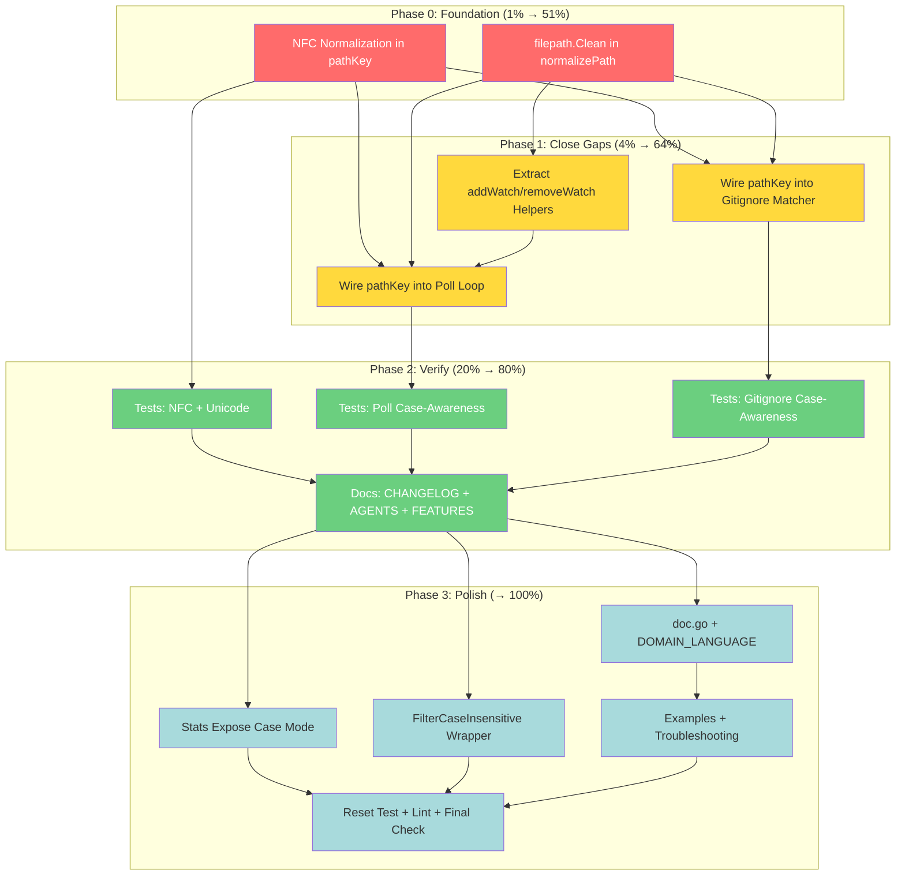

# Filesystem Awareness: Comprehensive Pareto Execution Plan

**Created:** 2026-07-28 23:30
**Status:** Planning
**Motivation:** Close the correctness gaps in the case-sensitivity implementation and
address the highest-impact filesystem properties from the research doc.

**Guiding Principle:** DO NOT VERSCHLIMMBESSER. Every change must make the system
measurably better, not just different. Small, correct, tested changes over large,
risky ones. If a change doesn't fix a real bug or deliver real user value, it doesn't
ship.

---

## Table of Contents

1. [Pareto Analysis](#1-pareto-analysis)
2. [Phase 1: 100–30min Tasks (Comprehensive Plan)](#2-phase-1-10030min-tasks)
3. [Phase 2: ≤12min Tasks (Micro Breakdown)](#3-phase-2-12min-tasks)
4. [Mermaid Execution Graph](#4-mermaid-execution-graph)
5. [Explicitly Out of Scope](#5-explicitly-out-of-scope)

---

## 1. Pareto Analysis

### The 1% That Delivers 51% of the Result

| #     | Task                                 | Why                                                                                                                                                                                                                                                                                                                             | Effort |
| ----- | ------------------------------------ | ------------------------------------------------------------------------------------------------------------------------------------------------------------------------------------------------------------------------------------------------------------------------------------------------------------------------------- | ------ |
| **1** | **NFC normalization in `pathKey()`** | Every macOS user has this bug TODAY. Event paths arrive as NFD (filesystem-enforced), but user-configured exclude paths, debounce keys, and gitignore patterns are NFC. They never match. This single 3-line change (`norm.NFC.String(path)`) fixes event matching, debounce, exclusion, and gitignore on macOS simultaneously. | 30min  |

### The 4% That Delivers 64% of the Result

| #     | Task                                         | Why                                                                                                                                                             | Effort |
| ----- | -------------------------------------------- | --------------------------------------------------------------------------------------------------------------------------------------------------------------- | ------ |
| 1     | NFC normalization in `pathKey()` (above)     | The 1% → 51%                                                                                                                                                    | 30min  |
| **2** | **`filepath.Clean()` in path normalization** | Prevents trailing-slash, `..`, and redundant-separator mismatches between `Add()`, `Remove()`, event paths, and exclude paths. One function, called everywhere. | 20min  |
| **3** | **Wire `pathKey()` into poll loop**          | Closes the #1 gap in our case-sensitivity work. Poll loop uses raw paths as map keys — case-only renames produce phantom Create+Remove on macOS.                | 45min  |
| **4** | **Wire `pathKey()` into gitignore matcher**  | Closes the #2 gap. Gitignore ancestor-prefix check uses raw `strings.HasPrefix` — case mismatch silently bypasses gitignore rules on macOS.                     | 30min  |

**Total: ~2h for 64% of the value.**

### The 20% That Delivers 80% of the Result

| #     | Task                                                 | Why                                                                                                                                                                                      | Effort |
| ----- | ---------------------------------------------------- | ---------------------------------------------------------------------------------------------------------------------------------------------------------------------------------------- | ------ |
| 1–4   | The 4% above (NFC, Clean, poll, gitignore)           | Core correctness                                                                                                                                                                         | 2h     |
| **5** | **Extract `addWatch()` / `removeWatch()` helpers**   | `watchList` and `watchListKeys` are parallel structures that must stay in sync. Currently updated independently in 5+ locations. A single helper eliminates the desync risk permanently. | 45min  |
| **6** | **Tests: NFC normalization**                         | Unicode paths (`café`, `München`, `東京`) through the full pipeline.                                                                                                                     | 30min  |
| **7** | **Tests: Poll loop case-awareness**                  | Verify snapshot keys are canonicalized.                                                                                                                                                  | 20min  |
| **8** | **Tests: Gitignore case-awareness**                  | Verify ancestor-prefix check uses `pathKey`.                                                                                                                                             | 20min  |
| **9** | **Documentation: CHANGELOG, AGENTS.md, FEATURES.md** | Record what shipped.                                                                                                                                                                     | 30min  |

**Total: ~4.5h for 80% of the value.**

### The Other 20% (to Reach 100%)

| #      | Task                                                 | Why                                                                                                  | Effort |
| ------ | ---------------------------------------------------- | ---------------------------------------------------------------------------------------------------- | ------ |
| **10** | **`Stats()` expose case-sensitivity mode**           | Observability: debug "why didn't Remove() work" by showing the resolved mode.                        | 15min  |
| **11** | **`doc.go` package documentation update**            | Mention case-sensitivity + NFC normalization in package-level docs.                                  | 10min  |
| **12** | **`example_test.go`: `WithCaseSensitivity` example** | Godoc runnable example.                                                                              | 15min  |
| **13** | **`Troubleshooting.md`: filesystem guide**           | Practical guide: "no events on NFS? → WithPolling. Wrong events on macOS? → Case sensitivity + NFC." | 30min  |
| **14** | **`DOMAIN_LANGUAGE.md`: filesystem terms**           | `FilesystemCaseSensitivity`, `pathKey`, `NFC normalization`.                                         | 10min  |
| **15** | **`FilterCaseInsensitive()` wrapper**                | Non-breaking opt-in for filter-level case-awareness. Wraps any Filter with path lowercasing.         | 20min  |
| **16** | **`Reset()` verification test**                      | Verify case-sensitivity config survives Reset().                                                     | 10min  |
| **17** | **Lint compliance check + fix**                      | Run `nix run .#check` and fix any issues from new code.                                              | 15min  |
| **18** | **Final full test suite run**                        | `nix run .#check` — 0 lint, all tests pass with `-race`.                                             | 5min   |

**Total: ~2.5h for the remaining 20%.**

**Grand total: ~7h for 100%.**

---

## 2. Phase 1: 100–30min Tasks

Sorted by impact (P0 first), then effort (low first within same priority).

| ID  | Priority | Task                                           | Files                                                  | Effort | Impact                                            | Customer Value          |
| --- | -------- | ---------------------------------------------- | ------------------------------------------------------ | ------ | ------------------------------------------------- | ----------------------- |
| T1  | 🔴 P0    | NFC normalization in `pathKey()`               | `filesystem.go`, `go.mod`                              | 30min  | Fixes #1 macOS correctness bug                    | All macOS users         |
| T2  | 🔴 P0    | `filepath.Clean()` in path normalization       | `filesystem.go` or `watcher.go`                        | 20min  | Fixes path comparison bugs (trailing slash, `..`) | All platforms           |
| T3  | 🟡 P1    | Wire `pathKey()` into poll loop snapshot       | `watcher_poll.go`                                      | 45min  | Closes case-sensitivity gap in polling            | macOS + polling users   |
| T4  | 🟡 P1    | Wire `pathKey()` into gitignore matcher        | `watcher_gitignore.go`                                 | 30min  | Closes case-sensitivity gap in gitignore          | macOS + gitignore users |
| T5  | 🟡 P1    | Extract `addWatch()` / `removeWatch()` helpers | `watcher_walk.go`, `watcher.go`, `watcher_selfheal.go` | 45min  | Prevents watchList/watchListKeys desync           | All users (maintenance) |
| T6  | 🟡 P1    | Tests: NFC + unicode normalization             | `filesystem_test.go`                                   | 30min  | Verifies macOS fix works                          | Developers              |
| T7  | 🟢 P2    | Tests: Poll loop case-awareness                | `watcher_poll_test.go` (new or existing)               | 20min  | Verifies poll fix                                 | Developers              |
| T8  | 🟢 P2    | Tests: Gitignore case-awareness                | `watcher_gitignore_test.go`                            | 20min  | Verifies gitignore fix                            | Developers              |
| T9  | 🟢 P2    | Documentation: CHANGELOG + AGENTS + FEATURES   | `CHANGELOG.md`, `AGENTS.md`, `FEATURES.md`             | 30min  | Records what shipped                              | All readers             |
| T10 | 🟢 P2    | `Stats()` expose case-sensitivity mode         | `watcher.go` (Stats struct)                            | 15min  | Observability for debugging                       | Operators               |
| T11 | 🟢 P2    | `FilterCaseInsensitive()` wrapper filter       | `filter.go`                                            | 20min  | Non-breaking opt-in for filters                   | Cross-platform users    |
| T12 | ⚪ P3    | `doc.go` + `DOMAIN_LANGUAGE.md` updates        | `doc.go`, `docs/DOMAIN_LANGUAGE.md`                    | 15min  | Package-level docs                                | New users               |
| T13 | ⚪ P3    | `example_test.go` + `Troubleshooting.md`       | `example_test.go`, `Troubleshooting.md`                | 30min  | Runnable examples + troubleshooting               | New users               |
| T14 | ⚪ P3    | Reset() verification + lint check + final test | various                                                | 20min  | QA gate                                           | Developers              |

**Total: ~5.5h (with buffer for testing: ~7h)**

---

## 3. Phase 2: ≤12min Tasks

Each Phase 1 task broken into micro-steps. Sorted by dependency, then impact.

| Micro-ID  | Parent | Task                                                                                         | Effort |
| --------- | ------ | -------------------------------------------------------------------------------------------- | ------ |
| **T1.1**  | T1     | Add `golang.org/x/text` to `go.mod` (`go get golang.org/x/text/unicode/norm`)                | 2min   |
| **T1.2**  | T1     | Add NFC import + normalization to `pathKey()` in `filesystem.go`                             | 5min   |
| **T1.3**  | T1     | Verify `go build ./...` compiles                                                             | 1min   |
| **T1.4**  | T1     | Update `vendorHash` in `flake.nix` if needed                                                 | 5min   |
| **T2.1**  | T2     | Add `normalizePath()` helper with `filepath.Clean(filepath.Abs(path))`                       | 5min   |
| **T2.2**  | T2     | Replace `filepath.Abs` calls in `New()` and `withResolvedPath()` with `normalizePath()`      | 5min   |
| **T2.3**  | T2     | Replace `filepath.Abs` in `FilterExcludePaths` and `WithExcludePaths` with `normalizePath()` | 3min   |
| **T2.4**  | T2     | Verify build + existing tests pass                                                           | 2min   |
| **T3.1**  | T3     | Add `w.pathKey(path)` to `pollWalkDir` when storing into snapshot map                        | 5min   |
| **T3.2**  | T3     | Add `w.pathKey(path)` to `pollDetectChanges` when building `current` map                     | 5min   |
| **T3.3**  | T3     | Update removed-file detection loop to use pathKey for snapshot lookup                        | 5min   |
| **T3.4**  | T3     | Verify poll tests pass                                                                       | 2min   |
| **T4.1**  | T4     | Normalize gitignoreDir keys in `gitignoreCache.load()` with `pathKey`                        | 5min   |
| **T4.2**  | T4     | Update `shouldSkipByGitignore` ancestor-prefix check to use `pathKey`                        | 5min   |
| **T4.3**  | T4     | Verify gitignore tests pass                                                                  | 2min   |
| **T5.1**  | T5     | Create `addToWatchList(path string)` method that updates both `watchList` + `watchListKeys`  | 5min   |
| **T5.2**  | T5     | Create `removeFromWatchList(path string)` method that updates both                           | 5min   |
| **T5.3**  | T5     | Replace direct `w.watchList = append(...)` in `tryAddPath` with `addToWatchList`             | 2min   |
| **T5.4**  | T5     | Replace direct append in `walkAndAddPaths` root tracking with `addToWatchList`               | 2min   |
| **T5.5**  | T5     | Replace direct append in `appendToWatchList` (self-heal) with `addToWatchList`               | 2min   |
| **T5.6**  | T5     | Replace direct manipulation in `Remove()` with `removeFromWatchList`                         | 5min   |
| **T5.7**  | T5     | Verify all tests pass with `-race`                                                           | 2min   |
| **T6.1**  | T6     | Write test: NFC path vs NFD path produce same `pathKey`                                      | 5min   |
| **T6.2**  | T6     | Write test: Unicode exclude path matches NFD event path                                      | 5min   |
| **T6.3**  | T6     | Write test: Unicode debounce key collision (NFC vs NFD)                                      | 5min   |
| **T7.1**  | T7     | Write test: Poll snapshot uses canonical keys (case-insensitive)                             | 5min   |
| **T7.2**  | T7     | Write test: Case-only rename in poll mode doesn't produce phantom events                     | 5min   |
| **T8.1**  | T8     | Write test: Gitignore ancestor-prefix match is case-aware                                    | 5min   |
| **T8.2**  | T8     | Write test: Gitignore rule applies with different-case directory                             | 5min   |
| **T9.1**  | T9     | Add CHANGELOG.md entry for NFC normalization + case-awareness fixes                          | 5min   |
| **T9.2**  | T9     | Update AGENTS.md gotcha #18 with NFC normalization note                                      | 3min   |
| **T9.3**  | T9     | Update FEATURES.md: add NFC normalization row                                                | 3min   |
| **T10.1** | T10    | Add `CaseSensitivity string` field to `Stats` struct                                         | 3min   |
| **T10.2** | T10    | Populate it in `Stats()` method from `effectiveCaseSensitivity.String()`                     | 3min   |
| **T10.3** | T10    | Add test: `Stats().CaseSensitivity` reflects configured mode                                 | 3min   |
| **T11.1** | T11    | Write `FilterCaseInsensitive(inner Filter) Filter` wrapper in `filter.go`                    | 5min   |
| **T11.2** | T11    | Write test for `FilterCaseInsensitive`                                                       | 5min   |
| **T12.1** | T12    | Update `doc.go` with case-sensitivity + NFC mention                                          | 5min   |
| **T12.2** | T12    | Add `FilesystemCaseSensitivity`, `pathKey`, `NFC` to DOMAIN_LANGUAGE.md                      | 5min   |
| **T13.1** | T13    | Add `ExampleWithCaseSensitivity` to `example_test.go`                                        | 10min  |
| **T13.2** | T13    | Add "Filesystem Compatibility" section to Troubleshooting.md                                 | 10min  |
| **T14.1** | T14    | Write test: `Reset()` preserves `caseSensitivity` config                                     | 5min   |
| **T14.2** | T14    | Run `nix run .#check` — fix any lint/test issues                                             | 5min   |
| **T14.3** | T14    | Final `nix run .#check` verification                                                         | 2min   |

**Total micro-tasks: 43 tasks, ~3.5h of focused work (with context-switching overhead: ~5h)**

---

## 4. Mermaid Execution Graph

**Legend:** 🔴 Red = P0 Foundation · 🟡 Yellow = P1 Gap Closure · 🟢 Green = P2 Verification · 🔵 Blue = P3 Polish

**Dependency rules:**

- T1 (NFC) must come before T3/T4/T6 — they all depend on `pathKey` being correct
- T2 (Clean) must come before T3/T4/T5 — path normalization is foundational
- T5 (helpers) must come before T3 — poll loop uses watch list operations
- T9 (docs) comes after all code changes are verified
- T14 (final check) is the gate — nothing ships without it

---

## 5. Explicitly Out of Scope

**These items are deliberately excluded to prevent Verschlimmbesserung:**

| Item                                                                       | Why Excluded                                                                                                     |
| -------------------------------------------------------------------------- | ---------------------------------------------------------------------------------------------------------------- |
| Filesystem probing (detect actual FS case-sensitivity at runtime)          | Fragile, platform-specific, adds I/O at startup. `runtime.GOOS` covers 95% of cases. v3 feature.                 |
| Filter signature change (`func(Event) bool` → `func(Event) (bool, error)`) | Breaking API change. Belongs in v3. `FilterCaseInsensitive` wrapper achieves the goal without breaking anything. |
| Inode tracking / hard link awareness                                       | Massive architecture change for <1% of users. Not worth the complexity.                                          |
| Network FS stat() timeout                                                  | Requires goroutine-per-stat with context, adds significant complexity. Risk of goroutine leaks. Defer to v3.     |
| kqueue overflow detection                                                  | Niche platform, hard to test, low user demand.                                                                   |
| `IN_CLOSE_WRITE` Op type                                                   | Requires bypassing fsnotify entirely. Huge change for a semantic improvement.                                    |
| OverlayFS layer detection                                                  | Kernel-dependent, fragile, hard to test. Documentation is sufficient.                                            |
| Rename correlation (Create+Remove → Rename)                                | Requires inode tracking. Very high effort, low ROI.                                                              |
| Timestamp resolution adaptation                                            | Complex (requires filesystem detection + resolution table). Poll interval already mitigates this for most users. |
| Website documentation updates                                              | Separate toolchain (Astro/Node), separate deploy cycle. Track in TODO_LIST.md.                                   |
| API_STABILITY.md entry                                                     | Only needed if we change the API surface (we don't — all changes are additive).                                  |

---

## Risk Assessment

| Risk                                                | Likelihood | Mitigation                                                                                                        |
| --------------------------------------------------- | ---------- | ----------------------------------------------------------------------------------------------------------------- |
| `golang.org/x/text` dependency conflicts            | Low        | Already in go.sum as indirect dep. Promoting to direct is safe.                                                   |
| NFC normalization breaks non-Unicode paths          | Very Low   | `norm.NFC.String()` is idempotent on ASCII (returns same bytes). Zero impact on non-Unicode paths.                |
| `filepath.Clean` changes behavior of existing tests | Low        | `Clean` only affects `..`, trailing slashes, redundant separators. Existing tests use clean paths.                |
| Poll loop pathKey change breaks snapshot semantics  | Medium     | Snapshot keys change from raw to canonical. Must update both `pollWalkDir` and `pollDetectChanges` atomically.    |
| `addWatch/removeWatch` helpers miss a call site     | Medium     | Use `grep` to find all `w.watchList = append` and direct `watchListKeys` mutations. Linter catches unused fields. |
| Linter complaints about new code                    | Low        | Run `nix run .#lint-fix` after each phase. Address immediately.                                                   |

---

## Execution Order (Recommended)

1. **T1** (NFC) → **T2** (Clean) — Foundation, ~50min
2. **T5** (Helpers) — Safety refactor before touching poll/gitignore, ~45min
3. **T3** (Poll) → **T4** (Gitignore) — Close the gaps, ~75min
4. **T6 + T7 + T8** (Tests) — Verify everything, ~70min
5. **T9** (Docs) — Record what shipped, ~30min
6. **T10 + T11** (Stats + Filter wrapper) — Additive features, ~35min
7. **T12 + T13** (Package docs + troubleshooting) — Documentation, ~25min
8. **T14** (Final QA gate) — Ship readiness, ~20min

**Total: ~5.75h focused work (add 30% buffer for debugging: ~7.5h)**
