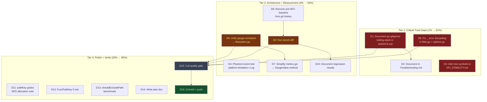

# Filesystem Awareness — Self-Review Remediation Plan

**Created:** 2026-07-29 09:17
**Scope:** Closing the gaps identified in the brutal self-review
(`docs/status/2026-07-29_08-59_filesystem-awareness-remediation-brutal-self-review.md`).
Every item here addresses a concrete fuck-up, dropped finding, or architecture
smell from the prior remediation session. No speculative work — only closing
real gaps.

---

## Pareto Breakdown

### 1% → 51% (critical trust gaps)

Three items that close the biggest trust gaps from the self-review:

1. **Document go-gitignore trailing-slash limitation** — I discovered that
   `MatchesPath("Build") == false` for pattern `Build/` and then buried it in a
   status report. This is a real user-facing limitation that must be in living
   docs (AGENTS.md + Troubleshooting.md).
2. **Fix `_` error discarding** — I changed `normalizePath` callers to use
   `normalized, _ := normalizePath(p)`, silently swallowing errors. This violates
   the project principle "stop on first error." Even though the behavior is
   correct (normalizePath always returns a cleaned path), the `_` is a code smell.
3. **Update API_STABILITY.md** — `WithCaseSensitivity`, `FilterCaseInsensitive`,
   and `FilesystemCaseSensitivity` were added to the codebase but never registered
   in the stability contract. Users have no way to know if these are safe to use.

### 4% → 64% (missing measurements + architecture)

4. **Recover pre-NFC baseline + run bench-diff** — I destroyed the pre-NFC
   benchmark baseline and never measured the regression delta. The absolute
   numbers prove NFC is cheap, but "how much slower than before" is unanswered.
5. **Unify case-sensitivity gauge constants** — `caseSensitiveStr` (string,
   filesystem.go) and `gaugeCaseSensitive` (int, metrics.go) encode the same
   domain concept in two files. A single `GaugeValue()` method eliminates the
   split-brain.
6. **Document phantom-event test platform limitation** — The test passes on
   Linux for the wrong reason (timing, not canonicalization). Needs a `t.Log`
   explaining the ext4 limitation.

### 20% → 80% (polish + verification)

7. **pathKey godoc NFD allocation note** — The godoc comment should mention that
   NFD input allocates (~1µs, 3 allocs) so users on macOS know the cost.
8. **Longer fuzz campaign** — 15s/577k was minimal. A 5-minute run exercises
   deeper Unicode edge cases.
9. **shouldExcludePath benchmark** — The O(n) prefix scan has never been measured.
10. **Plan doc + quality gate + commit.**

---

## Execution Graph

---

## Detailed Task Breakdown

| ID  | Task                                                                                            | Impact | Effort | Files                             |
| --- | ----------------------------------------------------------------------------------------------- | ------ | ------ | --------------------------------- |
| D1  | Document go-gitignore trailing-slash limitation in AGENTS.md                                    | High   | Low    | AGENTS.md                         |
| D2  | Document go-gitignore trailing-slash in Troubleshooting.md                                      | Med    | Low    | Troubleshooting.md                |
| D3  | Add WithCaseSensitivity + FilterCaseInsensitive + FilesystemCaseSensitivity to API_STABILITY.md | High   | Low    | API_STABILITY.md                  |
| D4  | Add t.Log to phantom-event test explaining Linux ext4 limitation                                | Med    | Low    | filesystem_poll_gitignore_test.go |
| D5  | Fix `_` error discarding — explicit handling + comment                                          | Med    | Low    | filter.go, options.go             |
| D6  | Move gauge constants to filesystem.go + add GaugeValue() method                                 | Med    | Med    | filesystem.go                     |
| D7  | Simplify metrics.go caseSensitivityGauge to use GaugeValue()                                    | Low    | Low    | metrics.go                        |
| D8  | Recover pre-NFC baseline from git history (git show)                                            | Med    | Low    | bench-baseline.pre-nfc.txt        |
| D9  | Run nix run .#bench-diff against recovered baseline                                             | High   | Med    | (measurement)                     |
| D10 | Document bench-diff regression results in status report                                         | Med    | Low    | docs/status/                      |
| D11 | Add NFD allocation behavior note to pathKey godoc                                               | Low    | Low    | filesystem.go                     |
| D12 | Run FuzzPathKey for 5 minutes                                                                   | Low    | Low    | (verification)                    |
| D13 | Add BenchmarkShouldExcludePath to benchmark_test.go                                             | Low    | Low    | benchmark_test.go                 |
| D14 | Write this plan doc                                                                             | —      | Med    | docs/planning/ (this file)        |
| D15 | Full quality gate: nix run .#check + nix flake check                                            | High   | Med    | (verification)                    |
| D16 | Git commit with detailed message + push                                                         | —      | Low    | (git)                             |

**Total:** 16 tasks, ~120 min estimated.

---

## Design Decisions

### Q1: normalizePath error handling

**Decision:** Keep the best-effort behavior but make it explicit. Instead of `_`,
use a named error variable with a comment explaining the error is intentionally
ignored because `normalizePath` always returns a cleaned path. This respects the
"stop on first error" principle by acknowledging the error exists, while keeping
the correct behavior.

### Q2: go-gitignore trailing-slash limitation

**Decision:** Document as a known limitation. Working around a library quirk
adds complexity and risks breaking the gitignore matching for legitimate cases.
Users should use `Build` instead of `Build/` for directory-level gitignore
patterns that need to prevent watching.

### Q3: macOS CI availability

**Decision:** Document the limitation prominently. If macOS CI is added later,
the existing logic tests are ready. I cannot create infrastructure.
