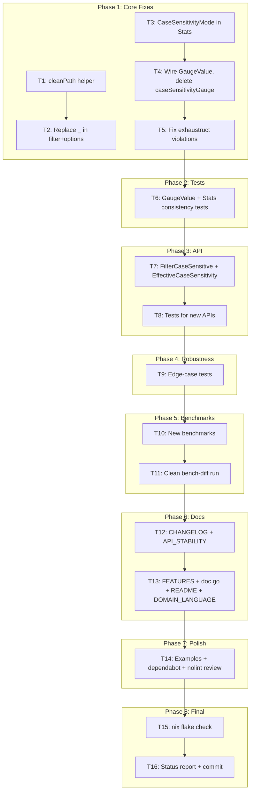

# Third Self-Review Remediation Plan

**Created:** 2026-07-29 14:06
**Source:** `docs/status/2026-07-29_09-44_self-review-remediation-second-brutal-review.md`
**Scope:** Close all critical, high, and medium-priority gaps from the third brutal self-review.

---

## Pareto Breakdown

### 1% → 51% (Critical — fix the damage from last session)

| # | Task | Impact | Why |
|---|------|--------|-----|
| 1 | Wire up `GaugeValue()` via `Stats.CaseSensitivityMode` enum field | Eliminates dead code, the #1 embarrassment | The method exists but is never called. Root cause: Stats stores a string, not the enum. Fix: add enum field to Stats (additive, non-breaking), call `GaugeValue()` from metrics, delete `caseSensitivityGauge()`. |
| 2 | Fix `_` error discarding with `cleanPath()` helper | Eliminates code smell | Comments don't fix smells. Create `cleanPath()` that returns best-effort cleaned path without error. |
| 3 | Update `CHANGELOG.md` | Release documentation | Code shipped without changelog. |

### 4% → 64% (High — close remaining gaps)

| # | Task | Impact | Why |
|---|------|--------|-----|
| 4 | Move `FilesystemCaseSensitivity` to Stable in API_STABILITY | Correct classification | Foundational enum controlling pathKey — values must not change. |
| 5 | Add tests for GaugeValue + Stats consistency | Prevent regression | Dead code was untested. Wire-up must be verified. |
| 6 | Add `FilterCaseSensitive(inner Filter)` for symmetry | API completeness | NFC-normalize without case-folding. Useful on macOS NFD paths. |
| 7 | Add `EffectiveCaseSensitivity()` method | API completeness | Type-safe enum access without calling heavier Stats(). |
| 8 | Run clean bench-diff (no parallel work) | Replace garbage data | Previous timing data invalidated by CPU contention. |

### 20% → 80% (Medium — robustness + polish)

| # | Task | Impact | Why |
|---|------|--------|-----|
| 9 | Robustness tests: trailing-slash Add, Unicode Remove, Reset pathKey | Prevent edge-case bugs | These code paths have no test coverage. |
| 10 | New benchmarks: FilterCaseInsensitive, pathKey emoji ZWJ | Performance visibility | Measure wrapper + deep Unicode cost. |
| 11 | Documentation: FEATURES.md, doc.go, README, DOMAIN_LANGUAGE.md | User-facing completeness | New APIs and behaviors undocumented. |
| 12 | Add examples: GaugeValue, EffectiveCaseSensitivity | Discoverability | New public APIs need runnable examples. |
| 13 | Audit dependabot alerts + document decision | Security posture | Check severity, decide blocking vs tracking. |
| 14 | Review nolint directives | Code hygiene | Ensure all are justified. |

---

## Decisions on Open Questions

### Q1: `Stats.CaseSensitivity` type — keep string or change to enum?

**Decision: Add `Stats.CaseSensitivityMode FilesystemCaseSensitivity` as an additive field.**

- Non-breaking (existing `CaseSensitivity string` stays for backward compat)
- Eliminates string→float mapping in metrics.go (call `GaugeValue()` directly)
- Gives users type-safe enum access
- Both fields always set from same source (`w.effectiveCaseSensitivity`) — no split-brain

### Q2: Dependabot vulnerabilities blocking Go releases?

**Decision: No. Website toolchain is separate from Go library. Track as TODO, don't block.**

### Q3: `FilesystemCaseSensitivity` Stable or Evolving?

**Decision: Stable.** Enum values are foundational (control `pathKey()`). Adding new values
(e.g., `CaseSensitivityProbed` in v3) is backward-compatible. `WithCaseSensitivity` stays
Evolving (auto-detection behavior may be refined). `FilterCaseInsensitive` stays Evolving.

---

## Execution Graph

---

## Detailed Task List (30 tasks, ≤12 min each)

| # | Phase | Task | Files | Est |
|---|-------|------|-------|-----|
| 1 | 1 | Create `cleanPath()` helper | filesystem.go | 5m |
| 2 | 1 | Replace `_` discarding in filter.go + options.go | filter.go, options.go | 5m |
| 3 | 1 | Add `CaseSensitivityMode` to Stats struct | watcher.go | 5m |
| 4 | 1 | Wire GaugeValue in metrics, delete caseSensitivityGauge | metrics.go, watcher.go | 8m |
| 5 | 1 | Fix exhaustruct violations (nil Stats, tests) | metrics.go, metrics_test.go | 8m |
| 6 | 1 | Verify Phase 1 | nix run .#check | 3m |
| 7 | 2 | Add TestGaugeValue + TestStats_Consistency | filesystem_test.go | 10m |
| 8 | 2 | Verify Phase 2 | nix run .#check | 3m |
| 9 | 3 | Add FilterCaseSensitive + EffectiveCaseSensitivity | filter.go, watcher.go | 10m |
| 10 | 3 | Add tests for FilterCaseSensitive + EffectiveCaseSensitivity | filter_test.go, watcher_test.go | 10m |
| 11 | 3 | Verify Phase 3 | nix run .#check | 3m |
| 12 | 4 | Add edge-case tests (trailing slash, Unicode Remove, Reset) | filesystem_test.go | 12m |
| 13 | 4 | Verify Phase 4 | nix run .#check | 3m |
| 14 | 5 | Add BenchmarkFilterCaseInsensitive + PathKey_EmojiZWJ | benchmark_test.go | 10m |
| 15 | 5 | Run clean bench-diff, record results | bench | 10m |
| 16 | 6 | Update CHANGELOG.md | CHANGELOG.md | 10m |
| 17 | 6 | Move FilesystemCaseSensitivity to Stable in API_STABILITY | API_STABILITY.md | 5m |
| 18 | 6 | Update FEATURES.md with new APIs + go-gitignore limitation | FEATURES.md | 8m |
| 19 | 6 | Add macOS NFD note to doc.go | doc.go | 5m |
| 20 | 6 | Update README gauge encoding section | README.md | 8m |
| 21 | 6 | Update DOMAIN_LANGUAGE.md | docs/DOMAIN_LANGUAGE.md | 8m |
| 22 | 6 | Document bench-diff methodology in AGENTS.md | AGENTS.md | 5m |
| 23 | 7 | Add ExampleGaugeValue + ExampleEffectiveCaseSensitivity | example_test.go | 10m |
| 24 | 7 | Update API_STABILITY.md with new symbols | API_STABILITY.md | 5m |
| 25 | 7 | Audit dependabot alerts + document decision | docs/status/ | 8m |
| 26 | 7 | Review nolint directives | *.go | 5m |
| 27 | 8 | Final nix flake check | nix | 5m |
| 28 | 8 | Write status report | docs/status/ | 10m |
| 29 | 8 | Update TODO_LIST.md | TODO_LIST.md | 5m |
| 30 | 8 | Commit | git | 3m |
