# Master Pareto Execution Plan — go-filewatcher

**Created:** 2026-10-07 08:17 CEST
**Input:** TODO_LIST.md (29 items + 9 open questions, harvested 08:14) + docs-health sweep debts (2026-10-07_08-14 report §b/§c)
**Method:** pareto-planning skill — 1%→51%, 4%→64%, 20%→80%, remainder→100%. Medium plan ≤27 tasks @ 30–100 min, fine plan ≤150 tasks @ ≤12 min. ALL todos included.

**Decision note:** open question ③ from the 08:14 report ("keep TODO_LIST at 29 or cut to 15?") is answered by this plan: **keep all 29** — every item is sourced and bounded; the plan orders them instead of amputating them. User-gated decisions stay gated (Q1–Q9) but get scheduled as _decision_ tasks so they cannot rot.

---

## 1. Pareto Breakdown

### 1% → 51% of the result

**The pipeline of truth.** Two work streams deliver over half the total value because everything else — PRs, releases, dependabot, trust in green — is blocked or poisoned without them:

1. **Push master (11 commits) + verify CI green on origin.** All open PRs' CI validates against origin/master; until the floor (`go 1.26.7`) and the docs sweep land, every PR run is suspect.
2. **CI guard on the go-directive floor.** Three incidents (2026-09-29, 2026-10-07 ×2) came from silent `go 1.27` bumps; the buildflow skip-list is name-fragile. A one-line CI assertion turns the war class into a red build instead of a silent flip — permanently.

### 4% → 64% of the result

Adds: **deadline work and integrity gates** —

3. **Ubuntu 26 runner migration audit (deadline 2026-10-12)** — warnings already in every run log; missing the deadline breaks all CI at once.
4. **Full `nix flake check` + second vendorHash leg** — the hermetic-build guarantee is only half-verified since the go.mod restore.
5. **Read the missed 03-10 report + run `check-rows.py` over the 86 archives** — the docs sweep declared victory on a presence gate; this proves row-level uniformity and closes the one unread report.
6. **Required status checks on master + `release.yml` workflow_dispatch** — a release PR merged while master was red; nothing structural prevents a repeat.

### 20% → 80% of the result

Adds the **hardening + docs-carrying-capacity + website-blocking** tier: AGENTS.md split, docs-consistency exemption zero, Windows/macOS CI matrices, website CI job + link checker + dependabot fixes, the reliability test trio, BuildFlow binary upgrade + upstream filings, dependabot PRs, pkg.go.dev, deploy runbook, status index.

### Remainder → 100%

Everything else: fuzz expansion, stress harness, docs content verification suite, bench re-capture, hygiene cluster, v3 grooming, ecosystem items, cross-repo (crush-config) follow-ups, and the nine user-gated decisions executed as decision-tasks.

---

## 2. Comprehensive Plan — 27 tasks @ 30–100 min (ALL todos)

Sorted by importance/impact/effort/customer-value. "Tier" = Pareto membership. "Src" = TODO_LIST item / open question / sweep-debt ID.

| #  | Task                                                                                                                                                                       | Min | Tier | Src                   | Value                            |
| -- | -------------------------------------------------------------------------------------------------------------------------------------------------------------------------- | --- | ---- | --------------------- | -------------------------------- |
| 1  | **Push master + verify CI green on origin** (fetch, rebase-check, push, watch runs, triage)                                                                                | 30  | 1%   | sweep-debt            | Unblock all PR CI                |
| 2  | **Go-directive floor guard + Go 1.27 matrix** (CI assertion asserting `go 1.26.7`; add 1.27 job; failure-path test; AGENTS note)                                           | 75  | 1%   | C1, C2                | Kills the war class              |
| 3  | **Ubuntu 26 runner migration audit** (deadline 2026-10-12) — inventory workflows, pin/adapt, verify                                                                        | 45  | 4%   | U1                    | All CI survives the migration    |
| 4  | **Required status checks + release.yml dispatch trigger**                                                                                                                  | 30  | 4%   | C3, C4                | No red-master releases           |
| 5  | **Full `nix flake check` + verify second vendorHash (flake.nix:111)**                                                                                                      | 45  | 4%   | sweep-debt (06-00 B6) | Hermetic build proven            |
| 6  | **Read + annotate the missed 03-10 report; annotate today's chain**                                                                                                        | 30  | 4%   | sweep-debt            | Report set complete              |
| 7  | **`check-rows.py` over 86 archived files; fix PARTIAL rows; re-run gate**                                                                                                  | 60  | 4%   | sweep-debt            | Archive trust proven             |
| 8  | **Docs-consistency exemption zero** (document `FilterGeneratedCodeFull`/`WithFilter` in FEATURES; shrink EXEMPT list; run gate locally)                                    | 45  | 20%  | D1                    | CI enforces doc truth            |
| 9  | **AGENTS.md split to ≤220 lines** (move File Org table, gogenfilter API notes, CI workflows table, Linter Cheat Sheet → `docs/`, pointers remain; verify concept survival) | 90  | 20%  | D2                    | Preflight green; faster sessions |
| 10 | **Status-dir index + CHANGELOG cosmetic fix** (`docs/status/README.md` active+archived index; blank-line fix)                                                              | 30  | 20%  | sweep-debt            | Drift-alarm status leg           |
| 11 | **Windows CI matrix** (job, platform skips, run+fix)                                                                                                                       | 60  | 20%  | T1                    | Cross-platform trust             |
| 12 | **macOS CI matrix** (job, NFC/case expectations, run+fix)                                                                                                                  | 60  | 20%  | T2                    | APFS/NFD provable                |
| 13 | **Reliability test trio** (ContentHashMaxSize(0) interaction; BudgetCap==WatchLimit @1.0; ErrorContext.Event)                                                              | 90  | 20%  | T5–T7                 | Pins debated semantics           |
| 14 | **Website CI job + link checker** (pnpm build job + html-validate; fix found links)                                                                                        | 90  | 20%  | W2, W3                | Site breakage caught pre-deploy  |
| 15 | **Website dependabot fixes + post-audit chores** (fast-uri/astro updates, build, redeploy, dedupe, override doc, sharp spot-check)                                         | 90  | 20%  | W1, W4                | Zero known vulns live            |
| 16 | **BuildFlow binary upgrade + findings triage** (rebuild, re-run, verify skip names; triage 9-tools/go-auto-upgrade/nix-checker/nix-build-verify/vulnix)                    | 100 | 20%  | C5                    | Findings signal restored         |
| 17 | **Upstream BuildFlow issues** (verify-before-filing; draft go-structure-linter + result-cache issues) — _submit needs approval (Q6)_                                       | 45  | 20%  | Q6                    | Fleet-wide hazard fixed          |
| 18 | **Dependabot PRs (#31, #32, #14) + prettier 3-file review**                                                                                                                | 45  | 20%  | H1, H2                | Churn cleared                    |
| 19 | **pkg.go.dev check + website small items** (crawl check, OG image, editLink/lastUpdated, changelog.mdx decision)                                                           | 45  | 20%  | sweep-debt, W5        | Public presence correct          |
| 20 | **Website deploy runbook** (flake-app refs, trailingSlash quirk, slug-verify step)                                                                                         | 45  | 20%  | D3                    | Deploys reproducible             |
| 21 | **Docs content verification suite** (DOMAIN_LANGUAGE, API_STABILITY, Troubleshooting, MIGRATION, ARCHITECTURE — claims vs code, fix findings)                              | 90  | 80%  | sweep-debt            | Zero doc lies                    |
| 22 | **Benchmark re-capture + README refresh** (quiet machine; diff; update table)                                                                                              | 60  | 80%  | C6                    | Perf claims true                 |
| 23 | **Fuzz expansion** (combinators, Event JSON, gitignore, case-insensitive filter+middleware; corpus run)                                                                    | 100 | 80%  | T3                    | Parser robustness                |
| 24 | **Large-tree stress harness** (100k-dir fixture; batch/budget/self-heal assertions; CI gating decision)                                                                    | 100 | 80%  | T4                    | Scale confidence                 |
| 25 | **Hygiene cluster** (gitleaks+codespell run, fix findings, /tmp cleanup)                                                                                                   | 30  | 80%  | H3, H4                | Clean repo & machine             |
| 26 | **v3 grooming + decision doc** (`docs/research/v3-decisions.md`: Q1 goreleaser, Q2 baseline, Q4 watchBackend, Q9 changelog policy, micro-polish bundle)                    | 60  | 80%  | V1–V3, Q1–Q4, Q9      | v3 path concrete                 |
| 27 | **Cross-repo bundle (crush-config)** (lessons.md commit; buildflow skill DB-path fix + fan-out verify)                                                                     | 45  | 80%  | sweep-debt            | Fleet learns                     |

Total ≈ 1,905 min ≈ 32 h of focused work.

**Dependency notes:** 1 blocks 4/18/26 (CI-gated and history-dependent items); 5 blocks 22 (bench on proven build); 14 blocks 15 (link checker before dep updates); 17 gates on user approval; 26 collects decisions that unblock several v3 TODOs.

---

## 3. Fine Breakdown — ≤12 min tasks (ALL todos)

Tier: **A** = 1%, **B** = 4%, **C** = 20%, **D** = 80%. All times in minutes, each ≤12.

| ID   | Task                                                                                                                      | Min | Tier | Task# |
| ---- | ------------------------------------------------------------------------------------------------------------------------- | --- | ---- | ----- |
| 1.1  | `git fetch` + divergence check vs origin/master                                                                           | 5   | A    | 1     |
| 1.2  | Push master (11 commits)                                                                                                  | 2   | A    | 1     |
| 1.3  | Watch CI runs on new HEAD (`gh run watch`)                                                                                | 10  | A    | 1     |
| 1.4  | Triage any red job; fix-forward or revert                                                                                 | 12  | A    | 1     |
| 2.1  | Write floor-assert check (grep `^go 1.26.7$` go.mod, clear error)                                                         | 10  | A    | 2     |
| 2.2  | Wire check into `ci.yml` (and `nix flake check` app)                                                                      | 10  | A    | 2     |
| 2.3  | Test failure path (temporarily bump directive in worktree)                                                                | 10  | A    | 2     |
| 2.4  | Add Go 1.27 entry to CI test matrix                                                                                       | 10  | A    | 2     |
| 2.5  | Run suite on both matrix versions; fix fallout                                                                            | 12  | A    | 2     |
| 2.6  | Document guard + matrix in AGENTS.md gotcha                                                                               | 10  | A    | 2     |
| 3.1  | Inventory `.github/workflows/*.yml` runner fields                                                                         | 10  | B    | 3     |
| 3.2  | Read GitHub runner-migration notes; list breakage risks                                                                   | 10  | B    | 3     |
| 3.3  | Pin `ubuntu-24.04` or adapt workflows                                                                                     | 10  | B    | 3     |
| 3.4  | Trigger + verify each workflow post-change                                                                                | 12  | B    | 3     |
| 4.1  | Set required status checks via `gh api` (master + release PRs)                                                            | 10  | B    | 4     |
| 4.2  | Add `workflow_dispatch` to `release.yml`                                                                                  | 5   | B    | 4     |
| 4.3  | Dry-run dispatch; verify tests+lint path                                                                                  | 10  | B    | 4     |
| 5.1  | Run `nix flake check` at quiet load; collect warnings                                                                     | 12  | B    | 5     |
| 5.2  | Verify second vendorHash (flake.nix:111) builds                                                                           | 12  | B    | 5     |
| 5.3  | Fix or document any mismatch (AGENTS procedure)                                                                           | 12  | B    | 5     |
| 5.4  | Record results in 08-14 report §b6 (annotate)                                                                             | 5   | B    | 5     |
| 6.1  | Read `2026-10-07_03-10_pr-review-ci-recovery` fully                                                                       | 10  | B    | 6     |
| 6.2  | Annotate resolved items inline; supersession banners if chain                                                             | 10  | B    | 6     |
| 6.3  | Harvest any open residue into TODO_LIST                                                                                   | 5   | B    | 6     |
| 7.1  | Run `check-rows.py` over `docs/status/archived/`                                                                          | 10  | B    | 7     |
| 7.2  | Run `check-rows.py` over `docs/planning/archived/`                                                                        | 5   | B    | 7     |
| 7.3  | Fix flagged PARTIAL rows (batch 1)                                                                                        | 12  | B    | 7     |
| 7.4  | Fix flagged PARTIAL rows (batch 2)                                                                                        | 12  | B    | 7     |
| 7.5  | Re-run both gates (`~~` presence + rows); record pass                                                                     | 5   | B    | 7     |
| 8.1  | Draft FEATURES rows for `FilterGeneratedCodeFull`/`WithFilter`                                                            | 12  | C    | 8     |
| 8.2  | Shrink EXEMPT_SYMBOLS in docs-consistency.yml                                                                             | 10  | C    | 8     |
| 8.3  | Run docs-consistency workflow locally; iterate                                                                            | 12  | C    | 8     |
| 9.1  | Inventory AGENTS.md concepts that must survive the move                                                                   | 12  | C    | 9     |
| 9.2  | Move File Organization table → `docs/file-organization.md`                                                                | 10  | C    | 9     |
| 9.3  | Move gogenfilter v3 API section → `docs/`                                                                                 | 12  | C    | 9     |
| 9.4  | Move CI Workflows table + Linter Cheat Sheet → `docs/`                                                                    | 12  | C    | 9     |
| 9.5  | Write one-line pointers at each removal site                                                                              | 10  | C    | 9     |
| 9.6  | Verify: every concept findable; `wc -l AGENTS.md` ≤ 220+tolerance                                                         | 12  | C    | 9     |
| 10.1 | Write `docs/status/README.md` (active index + archived pointer)                                                           | 12  | C    | 10    |
| 10.2 | Fix CHANGELOG v2.4.0 double blank line                                                                                    | 5   | C    | 10    |
| 11.1 | Add `windows-latest` job to ci.yml                                                                                        | 10  | C    | 11    |
| 11.2 | Add platform-specific test skips (no inotify)                                                                             | 12  | C    | 11    |
| 11.3 | Run Windows job; triage failures                                                                                          | 12  | C    | 11    |
| 11.4 | Fix + re-run Windows job                                                                                                  | 12  | C    | 11    |
| 11.5 | Document Windows semantics in Troubleshooting                                                                             | 10  | C    | 11    |
| 12.1 | Add `macos-latest` job to ci.yml                                                                                          | 10  | C    | 12    |
| 12.2 | Gate NFC/case tests to macOS; assert real-FS behavior                                                                     | 12  | C    | 12    |
| 12.3 | Run macOS job; triage failures                                                                                            | 12  | C    | 12    |
| 12.4 | Fix + re-run macOS job                                                                                                    | 12  | C    | 12    |
| 13.1 | Test: `WithContentHashing()` + `WithContentHashMaxSize(0)` interaction (pin current semantics)                            | 12  | C    | 13    |
| 13.2 | Test: option ordering variants for 13.1                                                                                   | 12  | C    | 13    |
| 13.3 | Test: `WatchBudgetCap == WatchLimit` at fraction 1.0                                                                      | 12  | C    | 13    |
| 13.4 | Test: `ErrorContext.Event` populated on error paths                                                                       | 12  | C    | 13    |
| 13.5 | Full suite + race; lint clean                                                                                             | 10  | C    | 13    |
| 14.1 | Write `website-build` workflow (pnpm install + build)                                                                     | 12  | C    | 14    |
| 14.2 | Add `html-validate` step (already a devDep)                                                                               | 10  | C    | 14    |
| 14.3 | Trigger on PR; verify green                                                                                               | 12  | C    | 14    |
| 14.4 | Wire link checker (html-validate config or Astro plugin)                                                                  | 12  | C    | 14    |
| 14.5 | Fix links the checker found                                                                                               | 12  | C    | 14    |
| 15.1 | `cd website && pnpm update` (fast-uri, astro)                                                                             | 12  | C    | 15    |
| 15.2 | `pnpm audit` → 0; `pnpm build` green                                                                                      | 12  | C    | 15    |
| 15.3 | Redeploy to Firebase; verify live                                                                                         | 12  | C    | 15    |
| 15.4 | `pnpm dedupe`; lockfile diff review                                                                                       | 12  | C    | 15    |
| 15.5 | Document postcss-selector-parser override + drop condition                                                                | 10  | C    | 15    |
| 15.6 | Spot-check sharp rendering on an image-heavy page                                                                         | 12  | C    | 15    |
| 16.1 | Rebuild + reinstall fleet buildflow binary                                                                                | 12  | C    | 16    |
| 16.2 | Re-run full pipeline; confirm exit 0                                                                                      | 12  | C    | 16    |
| 16.3 | Verify 3 skip names still resolve (`buildflow list providers`)                                                            | 10  | C    | 16    |
| 16.4 | Triage "9 tools unavailable" health warning                                                                               | 12  | C    | 16    |
| 16.5 | Triage go-auto-upgrade ×12 (samber/lo adopt-or-rebut)                                                                     | 12  | C    | 16    |
| 16.6 | Triage nix-checker ×8 + nix-build-verify/nix-hash-fix fate                                                                | 12  | C    | 16    |
| 16.7 | vulnix CVE decision (nixpkgs bump vs accepted debt)                                                                       | 12  | C    | 16    |
| 17.1 | Run verify-before-filing gate on both diagnoses                                                                           | 12  | C    | 17    |
| 17.2 | Draft issue A: go-structure-linter auto-bump (strace evidence)                                                            | 12  | C    | 17    |
| 17.3 | Draft issue B: result cache ignores pnpm-lock.yaml                                                                        | 12  | C    | 17    |
| 17.4 | Submit after user approval; link in AGENTS.md                                                                             | 5   | C    | 17    |
| 18.1 | Review + merge dependabot #31                                                                                             | 12  | C    | 18    |
| 18.2 | Review + merge dependabot #32                                                                                             | 12  | C    | 18    |
| 18.3 | Close or merge stale #14                                                                                                  | 10  | C    | 18    |
| 18.4 | Review prettier's 3 daemon-fixed files (`git log -p`)                                                                     | 12  | C    | 18    |
| 19.1 | Check pkg.go.dev crawl state for v2.4.0/v2.4.1                                                                            | 10  | C    | 19    |
| 19.2 | Request crawl if stale                                                                                                    | 5   | C    | 19    |
| 19.3 | OG image social-card render check                                                                                         | 12  | C    | 19    |
| 19.4 | Add editLink/lastUpdated to astro.config if missing                                                                       | 12  | C    | 19    |
| 19.5 | Decide + implement changelog.mdx gitignore (or document keep)                                                             | 10  | C    | 19    |
| 20.1 | Draft deploy runbook section (install→build→deploy flake apps)                                                            | 12  | C    | 20    |
| 20.2 | Document trailingSlash/cleanUrls quirk                                                                                    | 5   | C    | 20    |
| 20.3 | Add slug-verify step (`ls dist/guides/` before publish)                                                                   | 5   | C    | 20    |
| 20.4 | Place in AGENTS.md release section or RELEASE.md; review                                                                  | 10  | C    | 20    |
| 21.1 | Verify DOMAIN_LANGUAGE.md terms against code usage                                                                        | 12  | D    | 21    |
| 21.2 | Verify API_STABILITY.md claims (Evolving lists vs go doc)                                                                 | 12  | D    | 21    |
| 21.3 | Verify Troubleshooting.md procedures still reproducible                                                                   | 12  | D    | 21    |
| 21.4 | Verify MIGRATION.md claims against current API                                                                            | 12  | D    | 21    |
| 21.5 | Verify ARCHITECTURE.md vs current file layout                                                                             | 12  | D    | 21    |
| 21.6 | Fix findings batch 1                                                                                                      | 12  | D    | 21    |
| 21.7 | Fix findings batch 2                                                                                                      | 12  | D    | 21    |
| 22.1 | Confirm quiet machine (load check; no parallel sessions)                                                                  | 5   | D    | 22    |
| 22.2 | `nix run .#bench-baseline`                                                                                                | 12  | D    | 22    |
| 22.3 | `nix run .#bench-diff` vs old baseline; analyze                                                                           | 12  | D    | 22    |
| 22.4 | Update README benchmark table from fresh numbers                                                                          | 12  | D    | 22    |
| 23.1 | Fuzz `FilterAnd`/`FilterOr`/`FilterNot` composition                                                                       | 12  | D    | 23    |
| 23.2 | Fuzz `Event` JSON round-trip                                                                                              | 12  | D    | 23    |
| 23.3 | Fuzz gitignore matcher                                                                                                    | 12  | D    | 23    |
| 23.4 | Fuzz `FilterIgnoreDirsCaseInsensitive`                                                                                    | 12  | D    | 23    |
| 23.5 | Fuzz `MiddlewareDeduplicateCaseInsensitive`                                                                               | 12  | D    | 23    |
| 23.6 | Extended corpus run; triage crashes                                                                                       | 12  | D    | 23    |
| 24.1 | Write 100k-dir synthetic fixture generator                                                                                | 12  | D    | 24    |
| 24.2 | Harness: batched registration assertions                                                                                  | 12  | D    | 24    |
| 24.3 | Harness: budget enforcement assertions                                                                                    | 12  | D    | 24    |
| 24.4 | Harness: self-heal under load                                                                                             | 12  | D    | 24    |
| 24.5 | Decide CI gating (nightly vs per-PR; runtime budget)                                                                      | 10  | D    | 24    |
| 25.1 | Run gitleaks; triage findings                                                                                             | 10  | D    | 25    |
| 25.2 | Run codespell; triage findings                                                                                            | 10  | D    | 25    |
| 25.3 | Fix legitimate findings                                                                                                   | 12  | D    | 25    |
| 25.4 | Clean /tmp evidence logs (after CI green)                                                                                 | 5   | D    | 25    |
| 26.1 | Draft `docs/research/v3-decisions.md` skeleton (Q1–Q4, Q9 context)                                                        | 12  | D    | 26    |
| 26.2 | Write each decision's options + tradeoffs (goreleaser, baseline, watchBackend, changelog policy)                          | 12  | D    | 26    |
| 26.3 | Add v3 micro-polish bundle spec (Parse(), CaseSensitivityConfigured, lock-policy note, symlink dedup + concurrency tests) | 12  | D    | 26    |
| 26.4 | Review + link from ROADMAP v3 section                                                                                     | 10  | D    | 26    |
| 27.1 | Draft lessons.md entry (instrument writers before racing)                                                                 | 12  | D    | 27    |
| 27.2 | Commit in crush-config repo (not this repo)                                                                               | 10  | D    | 27    |
| 27.3 | Fix buildflow skill DB path reference; commit + fan-out verify                                                            | 12  | D    | 27    |
| 27.4 | Run skill fan-out integrity check                                                                                         | 5   | D    | 27    |

Total: 137 micro-tasks, every one ≤12 min. All 29 TODO_LIST items, 9 open questions (as decision tasks 17.1–17.4, 26.1–26.4), and all sweep debts are covered.

---

## 4. Execution Graph

```mermaid
flowchart TD
    subgraph T1PCT["1% → 51%: pipeline of truth"]
        A1[1.1-1.4 Push + CI green]
        A2[2.1-2.6 Floor guard + Go 1.27 matrix]
    end
    subgraph T4PCT["4% → 64%: deadlines + integrity"]
        B1[3.1-3.4 Ubuntu 26 audit ⏰10-12]
        B2[5.1-5.4 Full flake check + vendorHash 2]
        B3[6.1-6.3 Read 03-10 + annotate]
        B4[7.1-7.5 check-rows over archives]
        B5[4.1-4.3 Required checks + dispatch]
    end
    subgraph T20PCT["20% → 80%: hardening + capacity"]
        C1[8 Exemption zero]
        C2[9 AGENTS split]
        C3[10 Status index]
        C4[11 Windows CI]
        C5[12 macOS CI]
        C6[13 Test trio]
        C7[14 Website CI + links]
        C8[15 Website deps + chores]
        C9[16 BuildFlow upgrade + triage]
        C10[17 Upstream issues ⛔approval]
        C11[18 Dependabot PRs]
        C12[19 pkg.go.dev + small]
        C13[20 Deploy runbook]
    end
    subgraph REST["→ 100%"]
        D1[21 Docs verification suite]
        D2[22 Bench re-capture]
        D3[23 Fuzz expansion]
        D4[24 Stress harness]
        D5[25 Hygiene]
        D6[26 v3 decision doc]
        D7[27 Cross-repo bundle]
    end
    A1 --> A2
    A1 --> B1
    A1 --> B5
    A2 --> C6
    B2 --> D2
    B4 --> C3
    C7 --> C8
    C9 --> C10
    A1 --> C9
    C1 --> D6
    C2 --> D6
```

**Serial spine (critical path):** 1.1→1.4 → 2.1→2.6 → 3.x → 5.x → 9.x → 21.x. Parallelizable after task 1: website cluster (14/15), CI matrices (11/12), test trio (13), docs tasks (8/10/21).

---

## 5. Execution Rules (anti-Verschlimmbesserung)

1. **Do not break build.** Every code-touching task ends with `nix run .#check` (or scoped `go test`) green before moving on.
2. **One logical change per commit**; detailed conventional messages; `git status` + `--stat` before every commit (daemon territory — verify nothing foreign got staged).
3. **Never trust an agent/claim without a grep** — the 08:14 session proved absence-claims are where errors live (goreleaser "deleted" was false; AddRecursive "missing" was false).
4. **User-gated items stay gated**: 17.4 (upstream filings), open Q1–Q9 decisions are prepared, not decided.
5. **Annotation hygiene**: any report touched gets inline strikethroughs with evidence; no appendix-only.
6. **Quiet-machine rule** for 22.x (bench): no parallel sessions, per AGENTS.md bench discipline.
