# Comprehensive Execution Plan — go-filewatcher

> **ARCHIVED 2026-10-07** (docs-health sweep): forward items resolved inline below — `~~strikethrough~~` verdicts cite evidence. Live work lives in [TODO_LIST.md](../../TODO_LIST.md).

**Date:** 2026-05-03 01:49 CEST
**Branch:** `master` (ahead of origin by 2 commits)
**Scope:** ALL open TODOs from TODO_LIST.md + status report bugs + discovered improvements
**Constraint:** Each task ≤ 12 minutes
**Total Tasks:** 88
**Estimated Total:** ~13.5 hours

---

## Pareto Breakdown

| Tier                    | Tasks   | % of Total | Impact      | Description                           |
| ----------------------- | ------- | ---------- | ----------- | ------------------------------------- |
| **T1 — The 1%** → 51%   | #1–#5   | 6%         | 🔴 CRITICAL | Bugs & toolchain breaks. MUST DO NOW. |
| **T2 — The 4%** → 64%   | #6–#17  | 14%        | 🟠 HIGH     | Code quality, safety, obvious fixes   |
| **T3 — The 20%** → 80%  | #18–#38 | 24%        | 🟡 MEDIUM   | Test gaps, docs, DX infrastructure    |
| **T4 — The 80%** → 100% | #39–#88 | 57%        | 🟢 LOW      | Features, integrations, nice-to-haves |

---

## T1 — BUG FIXES & CRITICAL (1% → 51% Impact)

_Must-do. These are bugs, broken tooling, or things shipping to consumers that shouldn't._

| #  | Task | Files                                              | Est.                            | Impact | Why |
| -- | ---- | -------------------------------------------------- | ------------------------------- | ------ | --- |
| ~~ | 1    | Fix `Add()` double-append to `watchList` bug       | `watcher.go`, `watcher_walk.go` | 12m    | 🔴  |
| ~~ | 2    | Fix `MiddlewareBatch` timer error swallowing       | `middleware.go:342`             | 10m    | 🔴  |
| ~~ | 3    | Fix `handleNewDirectory` error swallowing          | `watcher_internal.go:193`       | 10m    | 🔴  |
| ~~ | 4    | Align flake.nix Go 1.24 → 1.26                     | `flake.nix`                     | 5m     | 🔴  |
| ~~ | 5    | Move `testing_helpers.go` out of production binary | `testing_helpers.go`            | 12m    | 🔴  |

---

## T2 — CODE QUALITY & SAFETY (4% → 64% Impact)

_Should-do immediately. Low effort, high reliability/safety improvement._

| #  | Task | Files                                                           | Est.                         | Impact | Why |
| -- | ---- | --------------------------------------------------------------- | ---------------------------- | ------ | --- |
| ~~ | 6    | Replace hand-rolled `Op.MarshalJSON` with `json.Marshal`        | `event.go:55`                | 5m     | 🟠  |
| ~~ | 7    | Protect `DefaultIgnoreDirs` from mutation                       | `watcher.go`                 | 5m     | 🟠  |
| ~~ | 8    | Simplify `errors.As` to `AsType[*WatcherError]`                 | `errors.go:94`               | 5m     | 🟠  |
| ~~ | 9    | Ring buffer for `MiddlewareSlidingWindowRateLimit`              | `middleware.go:168-176`      | 12m    | 🟠  |
| ~~ | 10   | Document `GlobalDebouncer` callback replacement caveat          | `debouncer.go`               | 5m     | 🟠  |
| ~~ | 11   | `FilterExcludePaths`: skip redundant `filepath.Abs` per event   | `filter.go:102`              | 8m     | 🟠  |
| ~~ | 12   | Validate `WithBuffer(0)` behavior — error or document           | `options.go`                 | 5m     | 🟠  |
| ~~ | 13   | Validate debounce durations — cap at reasonable max             | `options.go`, `debouncer.go` | 8m     | 🟠  |
| ~~ | 14   | Remove `nolint:unparam` from `getDebounceKey`                   | `watcher_internal.go`        | 5m     | 🟠  |
| ~~ | 15   | Validate `FilterRegex` compiles in constructor                  | `filter.go`                  | 5m     | 🟠  |
| ~~ | 16   | `handleNewDirectory`: propagate addPath errors to error handler | `watcher_internal.go`        | 10m    | 🟠  |
| ~~ | 17   | `MiddlewareBatch`: propagate timer flush errors                 | `middleware.go`              | 10m    | 🟠  |

---

## T3 — TEST COVERAGE GAPS (20% → 80% Impact)

_Close the holes. Low-to-medium effort, high confidence improvement._

| #  | Task | Files                                                                              | Est.                          | Impact | Why |
| -- | ---- | ---------------------------------------------------------------------------------- | ----------------------------- | ------ | --- |
| ~~ | 18   | Add rename event integration test                                                  | `watcher_test.go`             | 10m    | 🟡  |
| ~~ | 19   | Add multi-directory initialization test (`New([]string{d1,d2})`)                   | `watcher_test.go`             | 10m    | 🟡  |
| ~~ | 20   | Add buffer overflow / backpressure test                                            | `watcher_test.go`             | 10m    | 🟡  |
| ~~ | 21   | Add concurrent Add/Remove during active watching test                              | `watcher_test.go`             | 12m    | 🟡  |
| ~~ | 22   | Add non-recursive watching integration test                                        | `watcher_test.go`             | 10m    | 🟡  |
| ~~ | 23   | Close coverage gaps: `addPath` (83.3%), `walkDirFunc` (84.6%)                      | `watcher_walk_test.go`        | 12m    | 🟡  |
| ~~ | 24   | Close coverage gap: `Add` (84.6%) — test error paths                               | `watcher_test.go`             | 10m    | 🟡  |
| ~~ | 25   | Add test for `handleError()` stderr path                                           | `watcher_test.go`             | 10m    | 🟡  |
| ~~ | 26   | Add test for `GlobalDebouncer.Flush()`                                             | `debouncer_test.go`           | 8m     | 🟡  |
| ~~ | 27   | Add test for `handleError` with `ErrorContext`                                     | `watcher_test.go`             | 10m    | 🟡  |
| ~~ | 28   | Add `FilterGeneratedCodeFull` content-check tests for Templ/Protobuf               | `filter_gogen_test.go`        | 10m    | 🟡  |
| ~~ | 29   | Add `Example_FilterRegex` godoc example                                            | `example_test.go`             | 8m     | 🟡  |
| ~~ | 30   | Fix `TestErrorHandler_Async` — assert `callCount == 10`                            | `errors_test.go`              | 8m     | 🟡  |
| ~~ | 31   | Review parallel tests for race safety                                              | all `*_test.go`               | 12m    | 🟡  |
| ~~ | 32   | Fix flaky `TestWatcher_Stats_Metrics` timing sensitivity                           | `watcher_test.go`             | 10m    | 🟡  |
| ~~ | 33   | Fix flaky `TestWatcher_Watch_WithMiddleware` timing sensitivity                    | `watcher_test.go`             | 10m    | 🟡  |
| ~~ | 34   | Add `Watcher.Errors()` channel closure after `Close()` test                        | `watcher_test.go`             | 8m     | 🟡  |
| ~~ | 35   | Add error channel test for naturally-occurring fs errors                           | `watcher_test.go`             | 12m    | 🟡  |
| ~~ | 36   | Add test for `IsWatching()`/`IsClosed()` state transitions during failed `Watch()` | `watcher_test.go`             | 10m    | 🟡  |
| ~~ | 37   | Add test for `WithIgnorePatterns()` using glob patterns                            | `filter_test.go`, `filter.go` | 12m    | 🟡  |
| ~~ | 38   | Add coverage for phantom type methods: `IsZero`, `Equal`, `Compare`                | `phantom_types_test.go`       | 10m    | 🟡  |

---

## T4a — DOCUMENTATION & RELEASE (80% → 100% Impact)

_Enable adoption. Now that we're MIT-licensed, this matters._

| #  | Task | Files                                                             | Est.                               | Impact | Why |
| -- | ---- | ----------------------------------------------------------------- | ---------------------------------- | ------ | --- |
| ~~ | 39   | Populate CHANGELOG.md for v0.1.0 release                          | `CHANGELOG.md`                     | 5m     | 🟢  |
| ~~ | 40   | Populate CHANGELOG.md for v0.2.0 release                          | `CHANGELOG.md`                     | 5m     | 🟢  |
| ~~ | 41   | Write `CONTRIBUTING.md`                                           | new file                           | 12m    | 🟢  |
| ~~ | 42   | Write `CODE_OF_CONDUCT.md`                                        | new file                           | 8m     | 🟢  |
| ~~ | 43   | Add GitHub issue templates                                        | `.github/ISSUE_TEMPLATE/`          | 10m    | 🟢  |
| ~~ | 44   | Add GitHub PR template                                            | `.github/PULL_REQUEST_TEMPLATE.md` | 8m     | 🟢  |
| ~~ | 45   | Write Troubleshooting.md                                          | new file                           | 12m    | 🟢  |
| ~~ | 46   | Write migration guide for ErrorHandler signature change           | `MIGRATION.md`                     | 10m    | 🟢  |
| ~~ | 47   | Add structured logging example                                    | `examples/`                        | 10m    | 🟢  |
| ~~ | 48   | Document DI integration patterns in README                        | `README.md`                        | 10m    | 🟢  |
| ~~ | 49   | Consolidate `doc.go` — sync with README examples                  | `doc.go`                           | 10m    | 🟢  |
| ~~ | 50   | Add API stability doc                                             | new file                           | 10m    | 🟢  |
| ~~ | 51   | Adopt semver in CHANGELOG                                         | `CHANGELOG.md`                     | 8m     | 🟢  |
| ~~ | 52   | Check if `examples/` directory worth keeping vs `example_test.go` | —                                  | 10m    | 🟢  |
| ~~ | 53   | Update TODO_LIST.md — remove already-done items                   | `TODO_LIST.md`                     | 10m    | 🟢  |
| ~~ | 54   | Update `AGENTS.md` with MIT license info                          | `AGENTS.md`                        | 5m     | 🟢  |

---

## T4b — DX & INFRASTRUCTURE

| #  | Task | Files                                                  | Est.                               | Impact | Why |
| -- | ---- | ------------------------------------------------------ | ---------------------------------- | ------ | --- |
| ~~ | 55   | Add `nix run .#test` and `nix run .#lint` to flake.nix | `flake.nix`                        | 12m    | 🟢  |
| ~~ | 56   | Add Dependabot / Renovate config                       | `.github/dependabot.yml`           | 10m    | 🟢  |
| ~~ | 57   | Add benchmark regression detection in CI               | `.github/workflows/ci.yml`         | 10m    | 🟢  |
| ~~ | 58   | Add `-race` to benchmark CI step                       | `.github/workflows/ci.yml`         | 5m     | 🟢  |
| ~~ | 59   | Test `examples/` in CI pipeline                        | `.github/workflows/ci.yml`         | 10m    | 🟢  |
| ~~ | 60   | Configure GoReleaser                                   | `.goreleaser.yml`                  | 12m    | 🟢  |
| ~~ | 61   | Configure semantic-release                             | `.releaserc.yml`                   | 12m    | 🟢  |
| ~~ | 62   | Extract `drainEvents` to testutil package              | `testing_helpers.go` → `testutil/` | 8m     | 🟢  |

---

## T4c — FEATURES: CORE

_New capabilities that users have requested or are commonly expected._

| #  | Task | Files                                             | Est.                      | Impact | Why |
| -- | ---- | ------------------------------------------------- | ------------------------- | ------ | --- |
| ~~ | 63   | Implement `WatchOnce()` — API design & core logic | `watcher.go`              | 12m    | 🔵  |
| ~~ | 64   | Implement `WatchOnce()` — tests                   | `watcher_test.go`         | 12m    | 🔵  |
| ~~ | 65   | Add `Event.ModTime()` field — struct & option     | `event.go`, `options.go`  | 10m    | 🔵  |
| ~~ | 66   | Add `Event.ModTime()` — tests                     | `event_test.go`           | 8m     | 🔵  |
| ~~ | 67   | Add `Event.Size` field — struct & option          | `event.go`, `options.go`  | 10m    | 🔵  |
| ~~ | 68   | Add `Event.Size` — tests                          | `event_test.go`           | 8m     | 🔵  |
| ~~ | 69   | Add `MiddlewareThrottle` — drop excess events     | `middleware.go`           | 12m    | 🔵  |
| ~~ | 70   | Add `MiddlewareThrottle` — tests                  | `middleware_test.go`      | 10m    | 🔵  |
| ~~ | 71   | Add `MiddlewareRateBurst()` — token bucket        | `middleware.go`           | 12m    | 🔵  |
| ~~ | 72   | Add `MiddlewareRateBurst()` — tests               | `middleware_test.go`      | 10m    | 🔵  |
| ~~ | 73   | Add `WithIgnorePatterns()` using glob patterns    | `filter.go`, `options.go` | 10m    | 🔵  |
| ~~ | 74   | Add symlink following support — research & design | —                         | 12m    | 🔵  |
| ~~ | 75   | Add symlink following support — implementation    | `watcher_walk.go`         | 12m    | 🔵  |

---

## T4d — FEATURES: ADVANCED / OBSERVABILITY

_Nice-to-have. Higher effort, lower immediate priority._

| #  | Task | Files                                             | Est.                  | Impact | Why |
| -- | ---- | ------------------------------------------------- | --------------------- | ------ | --- |
| ~~ | 76   | Add `WithPolling(fallback)` — research & design   | —                     | 12m    | ⚪  |
| ~~ | 77   | Implement exponential backoff for errors          | `watcher_internal.go` | 12m    | ⚪  |
| ~~ | 78   | Context propagation through pipeline              | `watcher_internal.go` | 12m    | ⚪  |
| ~~ | 79   | Self-healing watcher — auto-reconnect             | `watcher.go`          | 12m    | ⚪  |
| ~~ | 80   | Prometheus metrics export                         | `middleware.go`       | 12m    | ⚪  |
| ~~ | 81   | OpenTelemetry integration                         | `middleware.go`       | 12m    | ⚪  |
| ~~ | 82   | Create debug mode with verbose structured logging | `options.go`          | 12m    | ⚪  |
| ~~ | 83   | Add error code constants                          | `errors.go`           | 8m     | ⚪  |
| ~~ | 84   | Add stack traces to `WatcherError`                | `errors.go`           | 8m     | ⚪  |
| ~~ | 85   | Circuit breaker middleware                        | `middleware.go`       | 12m    | ⚪  |
| ~~ | 86   | Dead letter queue middleware                      | `middleware.go`       | 12m    | ⚪  |

---

## T4e — EXTERNAL INTEGRATIONS

_Depends on other projects. Can only be planned here, executed externally._

| #  | Task | Files                                 | Est.     | Impact | Why |
| -- | ---- | ------------------------------------- | -------- | ------ | --- |
| ~~ | 87   | Integrate into file-and-image-renamer | external | 12m    | ⚪  |
| ~~ | 88   | Integrate into dynamic-markdown-site  | external | 12m    | ⚪  |
| ~~ | 89   | Integrate into auto-deduplicate       | external | 12m    | ⚪  |
| ~~ | 90   | Integrate into Cyberdom               | external | 12m    | ⚪  |

---

## Execution Graph

```mermaid
graph TD
    subgraph T1["🔴 T1: Bug Fixes — 1% → 51%"]
        T1_1["#1 Fix Add() double-append"]
        T1_2["#2 Fix MiddlewareBatch error swallow"]
        T1_3["#3 Fix handleNewDirectory error swallow"]
        T1_4["#4 Align flake.nix Go version"]
        T1_5["#5 Move testing_helpers.go"]
    end

    subgraph T2["🟠 T2: Code Quality — 4% → 64%"]
        T2_1["#6 Replace hand-rolled MarshalJSON"]
        T2_2["#7 Protect DefaultIgnoreDirs"]
        T2_3["#8 Simplify errors.As → AsType"]
        T2_4["#9 Ring buffer SlidingWindowRateLimit"]
        T2_5["#10 Document GlobalDebouncer caveat"]
        T2_6["#11 Skip redundant filepath.Abs"]
        T2_7["#12 Validate WithBuffer(0)"]
        T2_8["#13 Validate debounce durations"]
        T2_9["#14 Remove nolint:unparam"]
        T2_10["#15 Validate FilterRegex compile"]
        T2_11["#16 Propagate addPath errors"]
        T2_12["#17 Propagate timer flush errors"]
    end

    subgraph T3["🟡 T3: Test Coverage — 20% → 80%"]
        T3_1["#18 Rename event test"]
        T3_2["#19 Multi-dir init test"]
        T3_3["#20 Buffer overflow test"]
        T3_4["#21 Concurrent Add/Remove test"]
        T3_5["#22 Non-recursive watch test"]
        T3_6["#23 Close addPath/walkDirFunc coverage"]
        T3_7["#24 Close Add() coverage"]
        T3_8["#25 handleError stderr test"]
        T3_9["#26 GlobalDebouncer.Flush test"]
        T3_10["#27 ErrorContext test"]
        T3_11["#28 FilterGeneratedCodeFull content tests"]
        T3_12["#29 Example_FilterRegex"]
        T3_13["#30 Fix TestErrorHandler_Async"]
        T3_14["#31 Review parallel test safety"]
        T3_15["#32 Fix flaky Stats_Metrics"]
        T3_16["#33 Fix flaky Watch_WithMiddleware"]
        T3_17["#34 Errors channel closure test"]
        T3_18["#35 Natural fs error test"]
        T3_19["#36 State transition test"]
        T3_20["#37 WithIgnorePatterns test"]
        T3_21["#38 Phantom type coverage"]
    end

    subgraph T4a["🟢 T4a: Docs & Release"]
        T4a_1["#39-40 CHANGELOG entries"]
        T4a_2["#41 CONTRIBUTING.md"]
        T4a_3["#42 CODE_OF_CONDUCT.md"]
        T4a_4["#43-44 Issue/PR templates"]
        T4a_5["#45 Troubleshooting.md"]
        T4a_6["#46 Migration guide"]
        T4a_7["#47 Structured logging example"]
        T4a_8["#48 DI patterns docs"]
        T4a_9["#49-54 Doc consolidation"]
    end

    subgraph T4b["🟢 T4b: DX & Infra"]
        T4b_1["#55 Nix test/lint commands"]
        T4b_2["#56 Dependabot config"]
        T4b_3["#57-59 CI improvements"]
        T4b_4["#60-61 GoReleaser + semantic-release"]
        T4b_5["#62 Extract testutil"]
    end

    subgraph T4c["🔵 T4c: Core Features"]
        T4c_1["#63-64 WatchOnce"]
        T4c_2["#65-66 Event.ModTime"]
        T4c_3["#67-68 Event.Size"]
        T4c_4["#69-72 MiddlewareThrottle + Burst"]
        T4c_5["#73 WithIgnorePatterns"]
        T4c_6["#74-75 Symlink support"]
    end

    subgraph T4d["⚪ T4d: Advanced Features"]
        T4d_1["#76 WithPolling research"]
        T4d_2["#77 Exponential backoff"]
        T4d_3["#78 Context propagation"]
        T4d_4["#79 Self-healing watcher"]
        T4d_5["#80-81 Prometheus + OTel"]
        T4d_6["#82 Debug mode"]
        T4d_7["#83-86 Error enhancements"]
    end

    subgraph T4e["⚪ T4e: External Integrations"]
        T4e_1["#87 file-and-image-renamer"]
        T4e_2["#88 dynamic-markdown-site"]
        T4e_3["#89 auto-deduplicate"]
        T4e_4["#90 Cyberdom"]
    end

    T1 --> T2 --> T3 --> T4a
    T3 --> T4b
    T4a --> T4c --> T4d --> T4e
    T4b --> T4c
```

---

## Summary Statistics

| Tier                          | Tasks  | Total Est.              | % of Plan |
| ----------------------------- | ------ | ----------------------- | --------- |
| T1 — Bug Fixes & Critical     | 5      | 49 min                  | 6%        |
| T2 — Code Quality & Safety    | 12     | 78 min                  | 14%       |
| T3 — Test Coverage Gaps       | 21     | 208 min                 | 24%       |
| T4a — Documentation & Release | 16     | 150 min                 | 18%       |
| T4b — DX & Infrastructure     | 8      | 89 min                  | 9%        |
| T4c — Core Features           | 13     | 132 min                 | 15%       |
| T4d — Advanced Features       | 11     | 112 min                 | 13%       |
| T4e — External Integrations   | 4      | 48 min                  | 5%        |
| **TOTAL**                     | **90** | **~866 min / ~14.4 hr** | **100%**  |

---

## Deferred / Out of Scope

These items from TODO_LIST.md are either already done, not actionable, or infrastructure issues:

- ~~"Tag v0.1.0 release"~~ — DONE (tag exists)
- ~~"Tag v2.0.0 release"~~ — DONE as v0.2.0 (tag exists)
- ~~"Add coverage threshold enforcement in CI"~~ — DONE (CI has ≥90%)
- ~~"Document public API with godoc examples"~~ — DONE (16 examples in example_test.go)
- ~~"Add `MiddlewareBatch()`"~~ — DONE
- ~~"Add context cancellation integration test"~~ — DONE
- "Create standalone CLI tool" — Out of scope for library
- "Free disk space" / "Clear LSP diagnostic cache" / "Push unpushed commits" — Infrastructure, not code
- "Error sanitization", "Localizable error messages", "Error correlation IDs", "Error analytics", "Batch error handling", "Error rate limiting middleware" — YAGNI, no user request
- "Filter func type could return match metadata" — Breaking API change, needs RFC
- "Expose convertEvent for testing" — Internal function, use public API in tests
- "Implement DebounceEntry Mixin phantom type" — Marginal benefit
- "Remaining uint conversions" — Vague, no specific items
- "Explore fsnotify v2 API changes" — Research only, not actionable yet
- "Add `WithWatchedIgnoreDirs` option" — Overlapping with existing IgnoreDirs
- "Make `just check` pass with race detector" — justfile deprecated per AGENTS.md
- "Consider `Watcher.AddRecursive(path)`" / "Consider `WatchChanges()`" — Design exploration, not actionable
- "Windows-specific edge case tests" — No Windows CI, low ROI
- "Fuzz testing" — Nice-to-have, no fuzz targets defined
- "File content hashing option" — Complex, no user request

---

_Generated by Crush at 2026-05-03 01:49 CEST_
