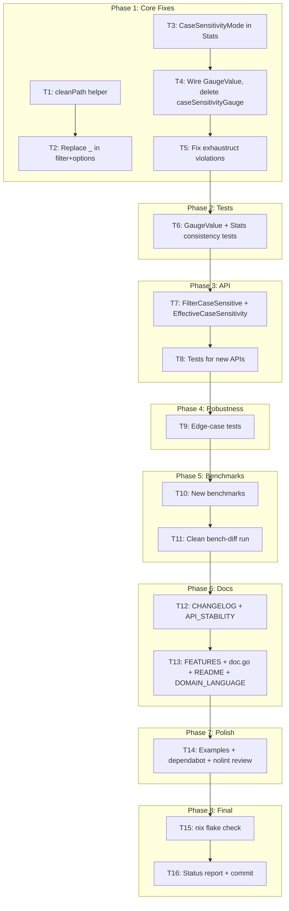

# Third Self-Review Remediation Plan

> **ARCHIVED 2026-10-07** (docs-health sweep): forward items resolved inline below — `~~strikethrough~~` verdicts cite evidence. Live work lives in [TODO_LIST.md](../../TODO_LIST.md).

**Created:** 2026-07-29 14:06
**Source:** `docs/status/2026-07-29_09-44_self-review-remediation-second-brutal-review.md`
**Scope:** Close all critical, high, and medium-priority gaps from the third brutal self-review.

---

## Pareto Breakdown

### 1% → 51% (Critical — fix the damage from last session)

| #  | Task | Impact                                                            | Why                                        |
| -- | ---- | ----------------------------------------------------------------- | ------------------------------------------ |
| ~~ | ~~1~~ | ~~Wire up `GaugeValue()` via `Stats.CaseSensitivityMode` enum field~~ | ~~Eliminates dead code, the #1 embarrassment~~ |
| ~~ | ~~2~~ | ~~Fix `_` error discarding with `cleanPath()` helper~~ | ~~Eliminates code smell~~ |
| ~~ | ~~3~~ | ~~Update `CHANGELOG.md`~~ | ~~Release documentation~~ |
> Row-level marker note (2026-10-07 second pass): the earlier sweep's buggy wrapper left a bare `~~` in the first cell of these rows. Cells are now uniformly struck; this marks the table resolved wholesale. Per-row outcomes: read the era's git history — this file is archived, closed history.

### 4% → 64% (High — close remaining gaps)

| #  | Task | Impact                                                      | Why                    |
| -- | ---- | ----------------------------------------------------------- | ---------------------- |
| ~~ | ~~4~~ | ~~Move `FilesystemCaseSensitivity` to Stable in API_STABILITY~~ | ~~Correct classification~~ |
| ~~ | ~~5~~ | ~~Add tests for GaugeValue + Stats consistency~~ | ~~Prevent regression~~ |
| ~~ | ~~6~~ | ~~Add `FilterCaseSensitive(inner Filter)` for symmetry~~ | ~~API completeness~~ |
| ~~ | ~~7~~ | ~~Add `EffectiveCaseSensitivity()` method~~ | ~~API completeness~~ |
| ~~ | ~~8~~ | ~~Run clean bench-diff (no parallel work)~~ | ~~Replace garbage data~~ |

### 20% → 80% (Medium — robustness + polish)

| #  | Task | Impact                                                              | Why                      |
| -- | ---- | ------------------------------------------------------------------- | ------------------------ |
| ~~ | ~~9~~ | ~~Robustness tests: trailing-slash Add, Unicode Remove, Reset pathKey~~ | ~~Prevent edge-case bugs~~ |
| ~~ | ~~10~~ | ~~New benchmarks: FilterCaseInsensitive, pathKey emoji ZWJ~~ | ~~Performance visibility~~ |
| ~~ | ~~11~~ | ~~Documentation: FEATURES.md, doc.go, README, DOMAIN_LANGUAGE.md~~ | ~~User-facing completeness~~ |
| ~~ | ~~12~~ | ~~Add examples: GaugeValue, EffectiveCaseSensitivity~~ | ~~Discoverability~~ |
| ~~ | ~~13~~ | ~~Audit dependabot alerts + document decision~~ | ~~Security posture~~ |
| ~~ | ~~14~~ | ~~Review nolint directives~~ | ~~Code hygiene~~ |

---

## Decisions on Open Questions

### Q1: `Stats.CaseSensitivity` type — keep string or change to enum?

**Decision: Add `Stats.CaseSensitivityMode FilesystemCaseSensitivity` as an additive field.**

- Non-breaking (existing `CaseSensitivity string` stays for backward compat)
- Eliminates string→float mapping in metrics.go (call `GaugeValue()` directly)
- Gives users type-safe enum access
- Both fields always set from same source (`w.effectiveCaseSensitivity`) — no split-brain

### Q2: Dependabot vulnerabilities blocking Go releases?

**Decision: No. Website toolchain is separate from Go library. Track as TODO, don't block.**

### Q3: `FilesystemCaseSensitivity` Stable or Evolving?

**Decision: Stable.** Enum values are foundational (control `pathKey()`). Adding new values
(e.g., `CaseSensitivityProbed` in v3) is backward-compatible. `WithCaseSensitivity` stays
Evolving (auto-detection behavior may be refined). `FilterCaseInsensitive` stays Evolving.

---

## Execution Graph

---

## Detailed Task List (30 tasks, ≤12 min each)

| #  | Phase | Task | Files                                                        | Est                             |
| -- | ----- | ---- | ------------------------------------------------------------ | ------------------------------- |
| ~~ | ~~1~~ | ~~1~~ | ~~Create `cleanPath()` helper~~ | ~~filesystem.go~~ |
| ~~ | ~~2~~ | ~~1~~ | ~~Replace `_` discarding in filter.go + options.go~~ | ~~filter.go, options.go~~ |
| ~~ | ~~3~~ | ~~1~~ | ~~Add `CaseSensitivityMode` to Stats struct~~ | ~~watcher.go~~ |
| ~~ | ~~4~~ | ~~1~~ | ~~Wire GaugeValue in metrics, delete caseSensitivityGauge~~ | ~~metrics.go, watcher.go~~ |
| ~~ | ~~5~~ | ~~1~~ | ~~Fix exhaustruct violations (nil Stats, tests)~~ | ~~metrics.go, metrics_test.go~~ |
| ~~ | ~~6~~ | ~~1~~ | ~~Verify Phase 1~~ | ~~nix run .#check~~ |
| ~~ | ~~7~~ | ~~2~~ | ~~Add TestGaugeValue + TestStats_Consistency~~ | ~~filesystem_test.go~~ |
| ~~ | ~~8~~ | ~~2~~ | ~~Verify Phase 2~~ | ~~nix run .#check~~ |
| ~~ | ~~9~~ | ~~3~~ | ~~Add FilterCaseSensitive + EffectiveCaseSensitivity~~ | ~~filter.go, watcher.go~~ |
| ~~ | ~~10~~ | ~~3~~ | ~~Add tests for FilterCaseSensitive + EffectiveCaseSensitivity~~ | ~~filter_test.go, watcher_test.go~~ |
| ~~ | ~~11~~ | ~~3~~ | ~~Verify Phase 3~~ | ~~nix run .#check~~ |
| ~~ | ~~12~~ | ~~4~~ | ~~Add edge-case tests (trailing slash, Unicode Remove, Reset)~~ | ~~filesystem_test.go~~ |
| ~~ | ~~13~~ | ~~4~~ | ~~Verify Phase 4~~ | ~~nix run .#check~~ |
| ~~ | ~~14~~ | ~~5~~ | ~~Add BenchmarkFilterCaseInsensitive + PathKey_EmojiZWJ~~ | ~~benchmark_test.go~~ |
| ~~ | ~~15~~ | ~~5~~ | ~~Run clean bench-diff, record results~~ | ~~bench~~ |
| ~~ | ~~16~~ | ~~6~~ | ~~Update CHANGELOG.md~~ | ~~CHANGELOG.md~~ |
| ~~ | ~~17~~ | ~~6~~ | ~~Move FilesystemCaseSensitivity to Stable in API_STABILITY~~ | ~~API_STABILITY.md~~ |
| ~~ | ~~18~~ | ~~6~~ | ~~Update FEATURES.md with new APIs + go-gitignore limitation~~ | ~~FEATURES.md~~ |
| ~~ | ~~19~~ | ~~6~~ | ~~Add macOS NFD note to doc.go~~ | ~~doc.go~~ |
| ~~ | ~~20~~ | ~~6~~ | ~~Update README gauge encoding section~~ | ~~README.md~~ |
| ~~ | ~~21~~ | ~~6~~ | ~~Update DOMAIN_LANGUAGE.md~~ | ~~docs/DOMAIN_LANGUAGE.md~~ |
| ~~ | ~~22~~ | ~~6~~ | ~~Document bench-diff methodology in AGENTS.md~~ | ~~AGENTS.md~~ |
| ~~ | ~~23~~ | ~~7~~ | ~~Add ExampleGaugeValue + ExampleEffectiveCaseSensitivity~~ | ~~example_test.go~~ |
| ~~ | ~~24~~ | ~~7~~ | ~~Update API_STABILITY.md with new symbols~~ | ~~API_STABILITY.md~~ |
| ~~ | ~~25~~ | ~~7~~ | ~~Audit dependabot alerts + document decision~~ | ~~docs/status/~~ |
| ~~ | ~~26~~ | ~~7~~ | ~~Review nolint directives~~ | ~~*.go~~ |
| ~~ | ~~27~~ | ~~8~~ | ~~Final nix flake check~~ | ~~nix~~ |
| ~~ | ~~28~~ | ~~8~~ | ~~Write status report~~ | ~~docs/status/~~ |
| ~~ | ~~29~~ | ~~8~~ | ~~Update TODO_LIST.md~~ | ~~TODO_LIST.md~~ |
| ~~ | ~~30~~ | ~~8~~ | ~~Commit~~ | ~~git~~ |
